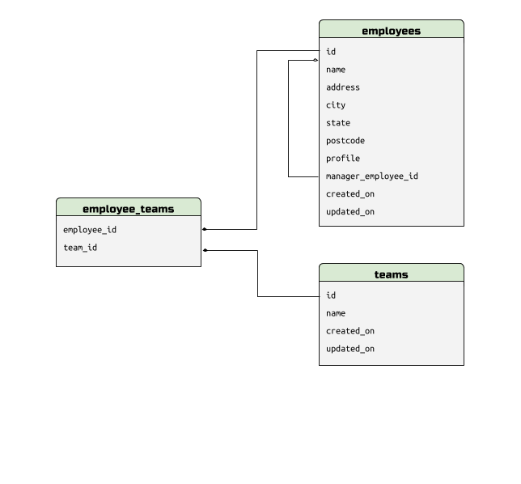

# Investigation into UUID vs. integer database performance

There have been a number of articles over the past five years or so that
describe some of the benefits, costs and potential pitfalls of using UUID
values as primary keys for database tables instead of the more traditional
auto-incrementing integer primary key.

Each of these articles tends to include some interesting graphs, but nearly all
of them focus on two metrics for benchmark data: the speed of `INSERT` and the
size of the table data and index data segments. While these metrics are both
very important, focusing on them exclusively means that there are some critical
points left out from the overall discussion of application performance and
query efficiency.

This article aims to provide a thorough comparison of UUID and integer field
performance. We'll be examining schemas that represent real-world application
scenarios and run a series of comparative benchmarks that demonstrate the
impact of using one strategy over another.

1. [Overview](#overview)
1. [Application database schemas](#application-databases)
    1. [Brick-and-mortar store](#brick-and-mortar-store)
    1. [Employee Directory](#employee-directory)
1. [Schema design strategies](#schema-design-strategies)
    1. [A: Auto-inc integer PK, no UUIDs](#schema-design-a-auto-incrementing-integer-primary-key-no-uuids)
    1. [B: UUID PK](#schema-design-b-uuid-pk)
    1. [C: Auto-inc integer PK, external UUIDs](#schema-design-c-auto-incrementing-integer-primary-key-external-uuids)
1. [Application data patterns](#application-data-patterns)
    1. [Data-access patterns](#data-access-patterns)
    1. [Data-write patterns](#data-write-patterns)
1. [Database server-configurations](#database-server-configurations)
    1. [MySQL Server](#mysql-server)
    1. [PostgreSQL](#postgresql)

## Overview

Many real-world applications show similar patterns with regards to the types of
queries that are common for the particular category of application.

For example, point-of-sale and work order management systems tend to have
mostly rigid search queries -- find products with a particular SKU or the work
orders for a customer having a specific phone number.

Customer relationship management (CRM) and enterprise resource planning (ERP)
applications tend to feature search capabilities that are either free-form
(fulltext) or allow the user to search for records based on some well-defined
relationship -- for instance, find all the wholesalers that have a reseller
arrangement with some set of suppliers.

When it comes to the performance of any particular query, it's important to
consider the query in the context of the application in which it runs. That's
why this article uses two archetypal applications in order to illustrate
real-world application query patterns.

We aim to answer a series of questions about the impact of using UUIDs versus
integer columns in the underlying database schema. These questions will examine
differences in read and write query performance as well as implications to
scale-out and partitioning.

## Application database schemas

I've tried as much as possible to do the comparison tests and benchmarks in
this article against database schemas that represent realistic applications
that might use an RDBMS for primary backend storage. To explore all the data
access patterns I wanted to explore, I created two different application
schemas, one for a "brick-and-mortar store" and another for a representing a
large hierarchical organization's employee directory.

### Brick and mortar store

The brick-and-mortar store point-of-sale application is all about recording
information for an imaginary home-goods store: orders, customer, suppliers,
products, etc.

### Employee directory

The employee directory application models a large organization's need for
employees to be able to find information about employees and the structure of
the organization. This schema and application will be used in comparing the
performance of queries involving self-referential tables and hierarchical graph
data.

## Schema design strategies

There are three different strategies for database schema design that we wish to
examine in this article:

* Schema design A: Auto-incrementing integer primary key, no UUIDs
* Schema design B: UUID primary key
* Schema design C: Auto-increment integer primary key, external UUIDs

### Schema design A: Auto-incrementing integer primary key, no UUIDs

TODO

### Schema design B: UUID primary key

TODO

### Schema design C: Auto-incrementing integer primary key, UUID externals

TODO

## Application data patterns

### Data-access patterns

* Single-table external key lookup
* Multi-table external key lookup
* Self-referential single-table lookup
* Self-referential multi-table lookup

#### Single-table external key lookup

TODO

#### Multi-table external key lookup

TODO

#### Self-referential single-table lookup

TODO

#### Self-referential multi-table lookup

TODO

### Data-write patterns

* Batched INSERTs, minimal UPDATEs or DELETEs
* Single-record INSERTs, UPDATEs, and DELETEs
* Multi-table transactions

#### Batched INSERTs, minimal UPDATEs or DELETEs

TODO

#### Single-record INSERTs, UPDATEs and DELETEs

TOOD

#### Multi-table transactions

TODO

## Database server configurations

This article runs a series of tests against a set of open source database
server configurations to see if there are noteworthy differences between the
performance of our schema design strategies.

The database server configurations we test are the following:

* MySQL Server 5.7 with InnoDB storage engine
* PostgreSQL 9.6

### MySQL Server

TODO

### PostgreSQL

TODO
