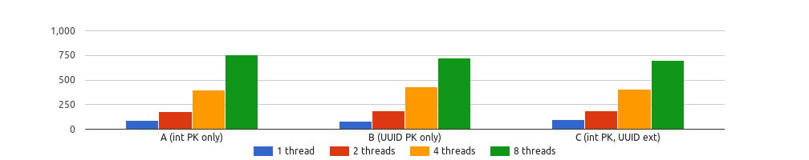
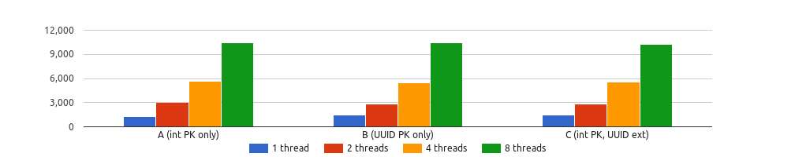
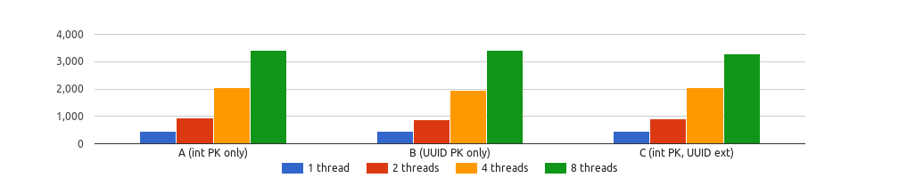
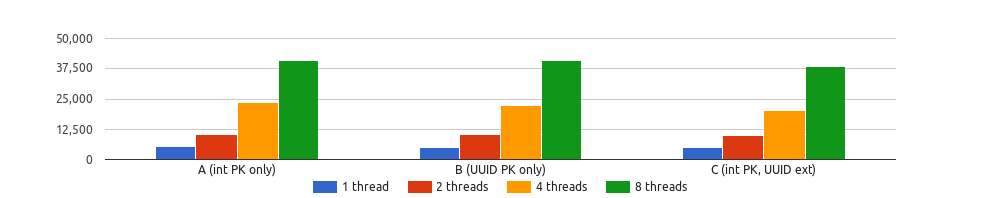
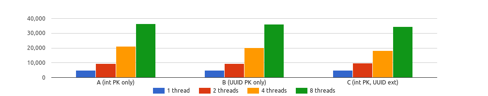
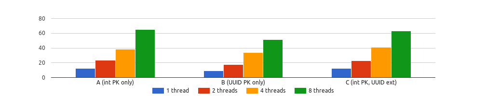
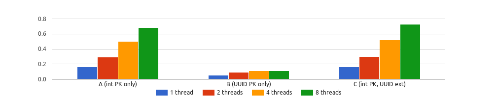
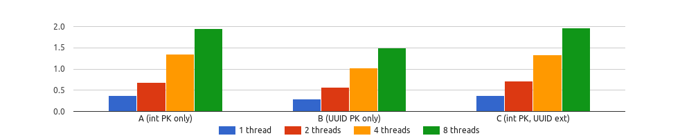

# Investigation into UUID vs. integer database performance

There have [been](http://kccoder.com/mysql/uuid-vs-int-insert-performance/) [a](https://cjsavage.com/guides/mysql/insert-perf-uuid-vs-ordered-uuid-vs-int-pk.html) [number](https://tomharrisonjr.com/uuid-or-guid-as-primary-keys-be-careful-7b2aa3dcb439) [of](http://krow.livejournal.com/497839.html) [articles](https://www.percona.com/blog/2007/03/13/to-uuid-or-not-to-uuid/) over the past ten years or so that
describe some of the benefits, costs and potential pitfalls of using UUID
values as primary keys for database tables instead of the more traditional
auto-incrementing integer primary key.

Each of these articles tends to include some interesting graphs, but nearly all
of them focus on two metrics for benchmark data: the raw speed of `INSERT`
statements and the size of the table data and index data segments. While these
metrics are both very important, focusing on them exclusively leaves out a
number of critical points from the overall discussion of application
performance, scaling strategies and query efficiency.

In addition, most of the articles I've read look strictly at MySQL (and InnoDB
storage engine) performance and don't touch the other great open source
database server, PostgreSQL.

In this article, I  aim to provide a thorough data-backed comparison of UUID
and integer field performance for both MySQL and PostgreSQL. We'll be examining
a schema that represents a real-world application and run a series of
comparative benchmark scenarios that demonstrate the impact of using one
strategy over another.

1. [Overview](#overview)
    1. [On external identifiers](#on-external-identifiers)
    1. [Scaling considerations](#scaling-considerations)
1. [Database schema](#database-schema)
    1. [UUID column type considerations](#uuid-column-type-considerations)
1. [Schema design strategies](#schema-design-strategies)
    1. [A: Auto-inc integer PK, no UUIDs](#schema-design-a-auto-incrementing-integer-primary-key-no-uuids)
    1. [B: UUID PK](#schema-design-b-uuid-pk)
    1. [C: Auto-inc integer PK, external UUIDs](#schema-design-c-auto-incrementing-integer-primary-key-external-uuids)
1. [Application scenarios](#application-scenarios)
    1. [New customer order](#new-customer-order)
    1. [Lookup customer orders](#lookup-customer-orders)
    1. [Order counts by status](#order-counts-by-status)
    1. [Lookup most popular items](#lookup-most-popular-items)
1. [Test configuration](#test-configuration)
    1. [Hardware setup](#hardware-setup)
    1. [Benchmark variants](#benchmark-variants)
    1. [DB setup](#db-setup)
1. [Benchmark results](#benchmark-results)
    1. [New customer order](#new-customer-order-results)
    1. [Lookup customer orders](#lookup-customer-order-results)
    1. [Order counts by status](#order-counts-by-status-results)
    1. [Lookup most popular items](#lookup-most-popular-items-results)
1. [Conclusions](#conclusions)

## Overview

When designing a relational database schema, application developers have to
decide what the **primary key** of each table should be. Some developers choose
a "natural primary key" that may exist for some entity -- e.g. a phone number
might be a good natural primary key for an employee entity. Other developers
choose what is called a "synthetic primary key", which is a number or string of
characters that is either sequentially or randomly generated.

This article will focus on assessing the impact of column type for developers
making the latter choice to use a synthetic primary key for their entities.
These developers typically choose to use either a sequentially-generated
integer or a randomly-generated UUID value as their primary key column type.

### On external identifiers

There are some *non* performance-related differences between integer and UUID
primary keys that are worth noting.

When it comes to how end users interact with the application -- and ultimately
with the relational database that backs that application -- there's a pretty
stark difference between applications that use integer vs UUID values as
**their external identifiers**. One might reasonably argue that a URL like
`https://example.com/products/123456` is more user-friendly and readable than a
URL that looks like
`https://example.com/products/27da46fb-f4c3-449e-bfc3-c2523ffeeebc`.

On the flip side, one might reasonably argue that having a
sequentially-incrementing integer primary key as your application's external
identifier means that a) competitors can trivially determine the number of
customers or sales orders that you have and b) allow crackers to guess a
critical identifier for customer information since identifiers are sequential
and guessable.

### Scaling considerations

When an application grows beyond the ability of a single database server or
cluster to service user needs, the application development team must figure out
how to **scale out** the application.

The most traditional and popular way of scaling out an application is to use a
**partitioning** or **sharding** strategy. The application database is cloned
into an application shard and that shard services a portion of the user
requests. While an in-depth discussion of the issues developers run into when
sharding their applications is beyond the scope of this article, it's important
to address one glaring issue that arises from using sequentially-incrementing
integers as **external identifiers** for an application.

Using sequentially-incrementing integers as external identifiers and primary
keys leads to trouble when attempting to shard an application for scale-out.
When cloning the application database for the new application shard, external
identifiers produced in the new shard will duplicate external identifiers from
the first shard unless the application developers use one of two strategies to
prevent this duplication.

One strategy is to take extreme care to set the starting integer sequence of
the new shard's database tables to a high value leaving room for the original
shard's incrementing identifier sequences to continue to grow as needed. Each
time a new shard is brought online, the same problem will arise.

The other strategy would be to have external identifiers contain an additional
"shard key" so that top-level application routers will be able to determine
which application shard to send a request to. For example, if each shard
contains a customers table that uses a sequentially-generated integer primary
key as the customer's external identifier, then an additional shard or
partition key will be needed by the top-level application router to determine
which shard to send a request for customer "123456" since both shard databases
could have "123456" as a primary key in their customers table.

UUIDs as external identifiers eliminate the above issues with regard to scaling
out via sharding. Since UUIDs are, well, universal, there's no need to worry
about duplicate external identifiers.

Schema design "C" discussed below is specially designed to benchmark the
performance of a database schema that uses UUID values for **external**
identifiers and sequentially-generated integers for **internal** primary keys.
This database schema doesn't suffer from the scale-out issues that arise from
using sequentially-generated integers as external identifiers.

## Database schema

Many real-world applications show similar patterns with regards to the types of
queries that are common for the particular category of application.

For example, point-of-sale and work order management systems tend to have
mostly rigid search queries -- find products with a particular SKU or the work
orders for a customer having a specific phone number.

Customer relationship management (CRM) and enterprise resource planning (ERP)
applications tend to feature search capabilities that are either free-form
(fulltext) or allow the user to search for records based on some well-defined
relationship -- for instance, find all the wholesalers that have a reseller
arrangement with some set of suppliers.

When it comes to the performance of any particular query, it's important to
consider the query in the context of the application in which it runs. That's
why this article uses an archetypal point-of-sale application in order to
illustrate real-world application query patterns. Instead of relying on
synthetic tables that don't represent actual data access patterns, we'll
examine queries that would actually be run against a real application and
examine the impact of using UUIDs versus integer columns has on these queries.

To explore all the data access patterns I wanted to explore, I created a
"brick-and-mortar" store point-of-sale application. This application is all
about recording information for an imaginary home-goods store: orders,
customers, suppliers, products, etc.


### UUID column type considerations

For UUID generation, I used a [Lua module](uuid-vs-integer/uuid.lua) that, with [some hacking](uuid-vs-integer/brick-and-mortar.lua#L1817-L1820) to support
thread-safe operations, generated UUIDs in a consistent fashion for each thread
executing. This allowed me to compare the impact of UUID vs integer primary
keys with permutations in initial database size.

For defining the UUID columns in MySQL, I went with a `CHAR(36)` column type.
I'm aware that there are various suggestions for making more efficient UUID
storage, including uusing a `BINARY(16)` column type or a `CHAR(32)` column
type (after stripping the '-' dash characters from the typical string UUID
representation). However, in my experience either `CHAR(36)`  or `VARCHAR(36)`
column types, with the dashes kept in the stored value, is the most common
representation of UUIDs in a MySQL database, and that's what I chose to compare
to.

Since PostgreSQL has a native UUID type, I used that column type and since
sysbench doesn't currently support native UUID parameter type binding, I used
the `CAST(?  AS UUID)` expression to convert the string UUID to a native
PostgreSQL UUID type where necessary.

## Schema design strategies

There are three different strategies for database schema design that we wish to
examine in this article:

* Schema design A: Auto-incrementing integer primary key, no UUIDs
* Schema design B: UUID primary key
* Schema design C: Auto-increment integer primary key, external UUIDs

### Schema design A: Auto-incrementing integer primary key, no UUIDs

Schema Design "A" represents a database design strategy that **_only_** uses
auto-incrementing integers as primary keys. Application users look up entities
by using this auto-incrementing integer as the identifier for various objects
in the system.

For MySQL, this means that tables in the application schemas are all defined
with an `id` column as the primary key in the following manner:

```sql
CREATE TABLE products (
  id INT NOT NULL AUTO_INCREMENT PRIMARY KEY,
  ...
);
```

For PostgreSQL, this means tables in the application schemas are all defined
with an `id` column as the primary key in the following manner:

```sql
CREATE TABLE products (
  id SERIAL NOT NULL PRIMARY KEY,
  ...
);
```

### Schema design B: UUID primary key

Schema Design "B" represents a database design strategy that **_only_** uses a
UUID column for the primary key of various entities. Application users use the
UUID as record identifiers.

For MySQL, this means that tables in the application schemas are all defined
with a `uuid` column as the primary key in the following manner:

```sql
CREATE TABLE products (
  uuid CHAR(36) NOT NULL PRIMARY KEY,
  ...
);
```

For PostgreSQL, this means tables in the application schemas are all defined
with an `uuid` column as the primary key in the following manner:

```sql
CREATE TABLE products (
  id UUID NOT NULL PRIMARY KEY,
  ...
);
```

Note that PostgreSQL has a native UUID type.

### Schema design C: Auto-incrementing integer primary key, UUID externals

Schema Design "C" represents a database design strategy that uses
auto-incrementing integers as the primary key for entities, but these integer
keys are not exposed to users. Instead, UUIDs are used as the identifiers that
application users utilize to look up specific records in the application.

In other words, there is a secondary unique constraint/key on a UUID column for
each table in the schema.

For MySQL, this means that tables in the application schemas are all defined
with an `id` column as the primary key and a `uuid` secondary key in the
following manner:

```sql
CREATE TABLE products (
  id INT NOT NULL AUTO_INCREMENT PRIMARY KEY,
  uuid CHAR(36) NOT NULL,
  ...
  UNIQUE INDEX uix_uuid (uuid)
);
```

For PostgreSQL, this means that tables in the application schemas are all
defined with an `id` column as the primary key and a `uuid` secondary key in
the following manner:

```sql
CREATE TABLE products (
  id SERIAL NOT NULL PRIMARY KEY,
  uuid UUID NOT NULL UNIQUE,
  ...
);
```

## Application scenarios

I wanted to show the impact of these schema designs/choices in **real-world
applications**. To that point, I developed a number of benchmark scenarios that
I thought represented some realistic data access and data write patterns.

For the brick-and-mortar application, I came up with these scenarios:

* New customer order
* Lookup customer orders
* Order counts by status
* Lookup most popular items

Following is an explanation of each scenario and the SQL statements from which
the scenario is composed.

### New customer order

The `customer_new_order` scenario emulates a single customer making a purchase
of items in the store. The steps involved are:

1. Look up some random products that have inventory at the store
1. (Schema design "C" only) Look up the customer's internal ID from their
   external UUID
1. Begin a transaction
1. Create an order record for the customer
1. (Schema design "A" and "C" only) Get the newly-inserted internal ID of the
   order
1. For each selected product:
    1. Look up a fulfilling supplier for the product
    1. Look up the current price of the product
    1. Create an order item record for the product and supplier on the order
1. Commit the transaction

This scenario is designed to stress both the `INSERT` performance for
multi-table transactions as well as read performance on a table scan (since we
purposely have no index used when ordering by `RAND()` when looking up products
for the customer to purchase).

For schema design "C", this also accurately stresses the impact of needing to
do one additional "point select" query for grabbing the internal customer ID
from the external customer UUID.

For schema designs "A" and "C", it also represents the need to perform an
additional query to retrieve the newly-created order's auto-incrementing
primary key before inserting order detail records. This step does not need to
be done for schema design "B" since the UUID is generated ahead of order record
creation.

### Lookup customer orders

The `lookup_orders_by_customer` scenario comes from the brick-and-mortar
application and is designed to emulate a query that would be run by a customer
service representative when a customer comes into the store and needs to find
some order information.

This scenario only entails a single `SELECT` query, but the query is designed
to stress a particular archetypal data access pattern: aggregating information
across a set of columns in a child table used in a secondary index (product and
supplier columns) while filtering records also on a secondary index in a parent
table (customer).

This query looks like this for schema design "A":

```sql
SELECT
 o.id,
 o.created_on,
 o.status,
 COUNT(*) AS num_items,
 SUM(od.quantity * od.price) AS total_amount
FROM orders AS o
JOIN order_details AS od
 ON o.id = od.order_id
WHERE o.customer_id = ?
GROUP BY o.id
ORDER BY o.created_on DESC
```

for schema design "B", the query is as follows:

```sql
SELECT
 o.uuid,
 o.created_on,
 o.status,
 COUNT(*) AS num_items,
 SUM(od.quantity * od.price) AS total_amount
FROM orders AS o
JOIN order_details AS od
 ON o.uuid = od.order_uuid
WHERE o.customer_uuid = ?
GROUP BY o.uuid
ORDER BY o.created_on DESC
```

and finally, for schema design "C", the query looks like this:

```sql
SELECT
 o.uuid,
 o.created_on,
 o.status,
 COUNT(*) AS num_items,
 SUM(od.quantity * od.price) AS total_amount
FROM orders AS o
JOIN order_details AS od
 ON o.id = od.order_id
JOIN customers AS c
 ON o.customer_id = c.id
WHERE c.uuid = ?
GROUP BY o.id
ORDER BY o.created_on DESC
```

Note that for schema design "C", since we use the UUID as the external
identifier for the customer, we need to join to the `customers` table in order to
query on the customer's UUID value. Since the UUID *is* the primary key in
schema design "B" and the auto-incrementing integer *is* the primary key in
schema design "A", those queries need not join to the `customers` table.

### Order counts by status

The `order_counts_by_status` scenario, from the brick-and-mortar
application, includes a single `SELECT` statement that is exactly the same for
each schema design:

```sql
SELECT o.status, COUNT(*) AS num_orders
FROM orders AS o
GROUP BY o.status
```

There is a secondary index on the `orders.status` table, so this particular
scenario is testing the impact of using UUIDs vs integer primary keys when the
only column being used in an aggregate query is *not* the primary key and there
is an index on that field. For MySQL with InnoDB, which uses a clustered index
organized table layout, this means that each secondary index record also
includes the primary key as well. So, we should be able to determine the impact
of primary key column type choice even for queries that seemingly do not
involve those primary keys.

### Lookup most popular items

The `lookup_most_popular_items` scenario, from the brick-and-mortar
application, includes a single `SELECT` statement that might be run by an
extract-transform-load (ETL) tool or an online analytical processing (OLAP)
program.

For the general manager of our brick-and-mortar store, she might want to know
which are the best-selling products and which suppliers are providing those
products.

The `SELECT` expression for this query looks like this:

```sql
SELECT
 p.name,
 s.name,
 COUNT(DISTINCT o.id) AS included_in_orders,
 SUM(od.quantity * od.price) AS total_purchased
FROM orders AS o
JOIN order_details AS od
 ON o.id = od.order_id
JOIN products AS p
 ON od.product_id = p.id
JOIN suppliers AS s
 ON od.fulfilling_supplier_id = s.id
GROUP BY p.id, s.id
ORDER BY COUNT(DISTINCT o.id) DESC
LIMIT 100
```

Note that there is no `WHERE` clause on the above, which means that there will
end up being a full table scan of the `order_details`. I've specifically
designed this query to show the impact that the choice of using UUID or
auto-incrementing primary keys has on sequential read performance.

## Test configuration

### Hardware and operating system setup

Some information about the hardware and platform used for the benchmarking:

* Single-processor system with an Intel Core i7 CPU @ 3.33GHz - 6 cores, 12 threads
* 24GB RAM
* Running Linux kernel 4.8.0-59-generic

All benchmarks were run overnight when nothing other than the benchmarks (and
the DB server of course) were running on the machine.

### Benchmark variants

All benchmark runs were done using sysbench 1.0.12, with **_30 seconds_** run
time for each scenario variation. The one scenario that writes records to a
table (`customer_new_order`) was run *after* the scenarios that only read
records. This was to ensure consistent results that were able to be compared
between different initial sizes of database.

For the brick-and-mortar application, I tested three sizes -- "small", "medium"
and "large" -- of databases. The "small" size was pre-loaded with approximately
4000 order detail records. The "medium" had around 21000 order detail records
and the "large" had around 1M order detail records. I did this to see the
relative impact of the base fact table (`order_details`) on the performance of
various operations.

Of course, 1M order detail records isn't a "large" database at all. However,
the sizing here is only relative to each other. The medium database is
approximately an order of magnitude greater than the small database. And the
large database is another order of magnitude greater than the medium.

It's worth noting that for the MySQL tests, the "large" database size
represented an `order_details` table that was greater than the total size of
the InnoDB buffer pool used by the server (128MB). You will note the impact of
exhausting the buffer pool and needing to spool records off disk in some of the
benchmarks below. You will see the impact of the database design and column
type choices on that unfortunate situation as well!

The benchmark script was written in Lua and is [included](uuid-vs-integer/brick-and-mortar.lua) in this article
repository for anyone to take a look at and critique.

### DB configuration

The database server configurations we test are the following:

* MySQL Server 5.7.19-17 using the default InnoDB storage engine
* PostgreSQL 9.5.7

**The DB configurations were completely stock**.

I made no adjustments for the purposes of tuning or anything else. The MySQL
`innodb_buffer_pool_size` was 128MB (the default). Besides needing to create a
database user in MySQL and PostgreSQL, I issued zero SQL statements outside of
the benchmark's statements.

## Benchmark results

Below, for each data access/write scenario, I give the results for the various
database sizes tested for both MySQL and PostgreSQL.

Note that **I'm not comparing MySQL and PostgreSQL here**. That's not the point
of interest in these benchmarks. Instead, I'm interested in seeing the impact
on each database server s performance when using UUIDs vs auto-incrementing
integers for primary keys.

Also note that I did no tuning or optimization whatsoever for either MySQL or
PostgreSQL. Again, the point is to identify the impact of primary key column
type choice on the performance of a variety of data write and read patterns.
The point of this benchmark isn't to tune a particular database for a specific
workload or compare MySQL to PostgreSQL.

The CSV files containing the parsed results of the sysbench runs are [available](uuid-vs-integer/results/)
in this article git repository.

### New customer order results

Here are the number of transactions per second that were possible (for N
concurrent threads) for the [`customer_new_order`](#new-customer-order) scenario. These transactions
are the number of new customer orders (including all order details) that could
be created per second. This event entails reads from a number of tables,
including `products` and `product_price_history` as well as writes to multiple
tables within a single transaction.

#### `customer_new_order` TPS / MySQL / Small DB size


| Schema design                     |       1      |      2      |      4      |      8      |
| --------------------------------- | ------------:| -----------:| -----------:| -----------:|
| A (auto-increment PKs no UUID)    |       193.33 |      416.24 |      854.21 |     1646.86 |
| B (UUID PKs only)                 |       131.45 (:small_red_triangle_down: 32.00%) |      293.09 (:small_red_triangle_down: 29.58%)|      650.58 (:small_red_triangle_down: 23.83%) |     1160.55 (:small_red_triangle_down: 29.52%) |
| C (auto-increment PK, ext UUID)   |       164.73 (:small_red_triangle_down: 14.79%)|      418.32 (:wavy_dash: +0.49%) |      775.80 (:small_red_triangle_down: 9.17%)|     1389.74 (:small_red_triangle_down: 15.61%) |


#### `customer_new_order` TPS / MySQL / Medium DB size


| Schema design                     |       1      |      2      |      4      |      8      |
| --------------------------------- | ------------:| -----------:| -----------:| -----------:|
| A (auto-increment PKs no UUID)    |       138.74 |      367.78 |      718.83 |     1417.25 |
| B (UUID PKs only)                 |       114.87 |      260.26 |      565.07 |     1027.15 |
| C (auto-increment PK, ext UUID)   |       121.28 |      333.61 |      696.10 |     1258.69 |

#### `customer_new_order` TPS / MySQL / Large DB size


| Schema design                     |       1      |      2      |      4      |      8      |
| --------------------------------- | ------------:| -----------:| -----------:| -----------:|
| A (auto-increment PKs no UUID)    |        46.39 |      112.80 |      333.28 |      586.64 |
| B (UUID PKs only)                 |        66.06 |      162.16 |      160.23 |      170.11 |
| C (auto-increment PK, ext UUID)   |        49.84 |      116.42 |      326.95 |      746.46 |

#### `customer_new_order` TPS / PostgreSQL / Small DB size



| Schema design                     |       1      |      2      |      4      |      8      |
| --------------------------------- | ------------:| -----------:| -----------:| -----------:|
| A (auto-increment PKs no UUID)    |        88.19 |      181.25 |      401.69 |      759.64 |
| B (UUID PKs only)                 |        85.04 |      184.81 |      427.15 |      723.35 |
| C (auto-increment PK, ext UUID)   |        94.53 |      185.23 |      409.03 |      700.94 |

#### `customer_new_order` TPS / PostgreSQL / Medium DB size


| Schema design                     |       1      |      2      |      4      |      8      |
| --------------------------------- | ------------:| -----------:| -----------:| -----------:|
| A (auto-increment PKs no UUID)    |        85.26 |      167.98 |      370.44 |      717.92 |
| B (UUID PKs only)                 |        80.66 |      167.91 |      371.69 |      689.94 |
| C (auto-increment PK, ext UUID)   |        82.44 |      170.41 |      340.48 |      694.29 |

#### `customer_new_order` TPS / PostgreSQL / Large DB size


| Schema design                     |       1      |      2      |      4      |      8      |
| --------------------------------- | ------------:| -----------:| -----------:| -----------:|
| A (auto-increment PKs no UUID)    |        66.07 |      126.03 |      240.17 |      480.51 |
| B (UUID PKs only)                 |        65.23 |      124.42 |      239.46 |      457.44 |
| C (auto-increment PK, ext UUID)   |        64.40 |      124.48 |      230.29 |      468.28 |

### Order counts per status results

Here are the number of transactions per second that were possible (for N
concurrent threads) for the `order_counts_by_status` scenario. These
transactions were an identical `SELECT` statement that returned the count of
orders per distinct status.

This `SELECT` statement involved an aggregate query against a single table
using a secondary index on the column involved in the grouping expression
(`orders.status`).

#### `order_counts_by_status` QPS / MySQL / Small DB size


| Schema design                     |       1      |      2      |      4      |      8      |
| --------------------------------- | ------------:| -----------:| -----------:| -----------:|
| A (auto-increment PKs no UUID)    |      1615.89 |     3075.88 |     7198.23 |    11203.62 |
| B (UUID PKs only)                 |      1549.78 |     2887.22 |     6702.80 |    10635.49 |
| C (auto-increment PK, ext UUID)   |      1544.83 |     2873.24 |     6545.08 |    10598.03 |

#### `order_counts_by_status` QPS / MySQL / Medium DB size


| Schema design                     |       1      |      2      |      4      |      8      |
| --------------------------------- | ------------:| -----------:| -----------:| -----------:|
| A (auto-increment PKs no UUID)    |       584.69 |     1119.66 |     2287.99 |     3643.57 |
| B (UUID PKs only)                 |       556.03 |     1062.13 |     2179.67 |     3388.88 |
| C (auto-increment PK, ext UUID)   |       556.27 |     1072.93 |     2114.73 |     3356.61 |

#### `order_counts_by_status` QPS / MySQL / Large DB size


| Schema design                     |       1      |      2      |      4      |      8      |
| --------------------------------- | ------------:| -----------:| -----------:| -----------:|
| A (auto-increment PKs no UUID)    |        46.92 |       93.21 |      174.94 |      270.34 |
| B (UUID PKs only)                 |        41.86 |       82.61 |      157.42 |      248.07 |
| C (auto-increment PK, ext UUID)   |        43.69 |       87.07 |      167.99 |      244.56 |

#### `order_counts_by_status` QPS / PostgreSQL / Small DB size



| Schema design                     |       1      |      2      |      4      |      8      |
| --------------------------------- | ------------:| -----------:| -----------:| -----------:|
| A (auto-increment PKs no UUID)    |      1254.54 |     2996.22 |     5668.34 |    10450.70 |
| B (UUID PKs only)                 |      1439.05 |     2849.36 |     5468.08 |    10473.11 |
| C (auto-increment PK, ext UUID)   |      1455.38 |     2875.40 |     5527.62 |    10248.12 |

#### `order_counts_by_status` QPS / PostgreSQL / Medium DB size



| Schema design                     |       1      |      2      |      4      |      8      |
| --------------------------------- | ------------:| -----------:| -----------:| -----------:|
| A (auto-increment PKs no UUID)    |       466.88 |      946.12 |     2043.78 |     3406.51 |
| B (UUID PKs only)                 |       457.35 |      872.31 |     1953.07 |     3412.37 |
| C (auto-increment PK, ext UUID)   |       453.27 |      899.54 |     2036.88 |     3284.91 |

#### `order_counts_by_status` QPS / PostgreSQL / Large DB size


| Schema design                     |       1      |      2      |      4      |      8      |
| --------------------------------- | ------------:| -----------:| -----------:| -----------:|
| A (auto-increment PKs no UUID)    |        43.38 |       84.24 |      158.37 |      249.28 |
| B (UUID PKs only)                 |        43.37 |       81.41 |      165.51 |      246.39 |
| C (auto-increment PK, ext UUID)   |        42.13 |       83.65 |      162.79 |      240.66 |

### Lookup customer orders results

Here are the number of transactions per second that were possible (for N
concurrent threads) for the `lookup_orders_by_customer` scenario. These
transactions were a single `SELECT` statement that returned the latest (by
created_on date) orders for a customer, with the number of items in the order
and the amount of the order. This `SELECT` statement involved a lookup via
customer external identifier (either auto-incrementing integer key or UUID)
along with an aggregate operation across a set of records in the
`order_details` table via a multi-table `JOIN` operation.

#### `lookup_orders_by_customer` QPS / MySQL / Small DB size


| Schema design                     |       1      |      2      |      4      |      8      |
| --------------------------------- | ------------:| -----------:| -----------:| -----------:|
| A (auto-increment PKs no UUID)    |      5930.91 |    11430.37 |    23525.73 |    40916.91 |
| B (UUID PKs only)                 |      5266.74 |    10396.43 |    22760.17 |    39067.47 |
| C (auto-increment PK, ext UUID)   |      4901.82 |    10004.68 |    20750.32 |    36366.61 |

#### `lookup_orders_by_customer` QPS / MySQL / Medium DB size


| Schema design                     |       1      |      2      |      4      |      8      |
| --------------------------------- | ------------:| -----------:| -----------:| -----------:|
| A (auto-increment PKs no UUID)    |      5097.35 |     9967.02 |    21322.79 |    37746.48 |
| B (UUID PKs only)                 |      4706.99 |     9606.48 |    20007.97 |    35569.34 |
| C (auto-increment PK, ext UUID)   |      4182.20 |     8869.60 |    18231.92 |    33571.22 |

#### `lookup_orders_by_customer` QPS / MySQL / Large DB size


| Schema design                     |       1      |      2      |      4      |      8      |
| --------------------------------- | ------------:| -----------:| -----------:| -----------:|
| A (auto-increment PKs no UUID)    |      2404.02 |     4785.85 |    10014.97 |    18708.46 |
| B (UUID PKs only)                 |      1848.24 |     3812.25 |     6326.06 |     8994.89 |
| C (auto-increment PK, ext UUID)   |      2380.97 |     4582.94 |     9561.05 |    17585.76 |

#### `lookup_orders_by_customer` QPS / PostgreSQL / Small DB size



| Schema design                     |       1      |      2      |      4      |      8      |
| --------------------------------- | ------------:| -----------:| -----------:| -----------:|
| A (auto-increment PKs no UUID)    |      5535.84 |    10517.41 |    23550.26 |    40626.90 |
| B (UUID PKs only)                 |      5398.67 |    10588.56 |    22427.03 |    40596.57 |
| C (auto-increment PK, ext UUID)   |      4992.97 |    10000.48 |    20384.42 |    38204.45 |

#### `lookup_orders_by_customer` QPS / PostgreSQL / Medium DB size



| Schema design                     |       1      |      2      |      4      |      8      |
| --------------------------------- | ------------:| -----------:| -----------:| -----------:|
| A (auto-increment PKs no UUID)    |      4950.84 |     9455.83 |    21038.52 |    36402.19 |
| B (UUID PKs only)                 |      4877.40 |     9420.81 |    20228.23 |    36158.88 |
| C (auto-increment PK, ext UUID)   |      4769.36 |     9672.92 |    18087.29 |    34486.62 |

#### `lookup_orders_by_customer` QPS / PostgreSQL / Large DB size


| Schema design                     |       1      |      2      |      4      |      8      |
| --------------------------------- | ------------:| -----------:| -----------:| -----------:|
| A (auto-increment PKs no UUID)    |      1920.31 |     4170.13 |     7712.94 |    15930.49 |
| B (UUID PKs only)                 |      1901.57 |     4093.66 |     7169.58 |    14934.87 |
| C (auto-increment PK, ext UUID)   |      1993.65 |     3768.92 |     7484.78 |    14854.96 |

### Lookup most popular items results

Here are the number of transactions per second that were possible (for N
concurrent threads) for the `lookup_most_popular_items` scenario. These
transactions were a single `SELECT` statement that returned the most
popular-selling items in the store and the supplier that fulfilled that product
the most. It involves a full table scan of all records in the `order_details`
table and `JOIN` operations to multiple tables including the `products` and
`suppliers` tables.

#### `popular_items` QPS / MySQL / Small DB size


| Schema design                     |       1      |      2      |      4      |      8      |
| --------------------------------- | ------------:| -----------:| -----------:| -----------:|
| A (auto-increment PKs no UUID)    |        59.81 |      113.44 |      196.46 |      312.38 |
| B (UUID PKs only)                 |        43.34 |       83.35 |      132.46 |      230.66 |
| C (auto-increment PK, ext UUID)   |        64.11 |      119.79 |      187.27 |      325.28 |

#### `popular_items` QPS / MySQL / Medium DB size



| Schema design                     |       1      |      2      |      4      |      8      |
| --------------------------------- | ------------:| -----------:| -----------:| -----------:|
| A (auto-increment PKs no UUID)    |        12.49 |       23.14 |       38.50 |       64.81 |
| B (UUID PKs only)                 |         9.43 |       17.69 |       33.69 |       51.24 |
| C (auto-increment PK, ext UUID)   |        12.06 |       22.52 |       41.17 |       63.02 |

#### `popular_items` QPS / MySQL / Large DB size



| Schema design                     |       1      |      2      |      4      |      8      |
| --------------------------------- | ------------:| -----------:| -----------:| -----------:|
| A (auto-increment PKs no UUID)    |         0.16 |        0.29 |        0.50 |        0.68 |
| B (UUID PKs only)                 |         0.05 |        0.09 |        0.11 |        0.11 |
| C (auto-increment PK, ext UUID)   |         0.16 |        0.30 |        0.52 |        0.73 |

#### `popular_items` QPS / PostgreSQL / Small DB size


| Schema design                     |       1      |      2      |      4      |      8      |
| --------------------------------- | ------------:| -----------:| -----------:| -----------:|
| A (auto-increment PKs no UUID)    |        87.55 |      173.34 |      337.37 |      512.03 |
| B (UUID PKs only)                 |        78.98 |      156.74 |      295.90 |      446.05 |
| C (auto-increment PK, ext UUID)   |        87.94 |      173.78 |      317.02 |      484.17 |

#### `popular_items` QPS / PostgreSQL / Medium DB size


| Schema design                     |       1      |      2      |      4      |      8      |
| --------------------------------- | ------------:| -----------:| -----------:| -----------:|
| A (auto-increment PKs no UUID)    |        19.12 |       37.78 |       69.72 |      106.62 |
| B (UUID PKs only)                 |        13.51 |       26.21 |       48.32 |       71.11 |
| C (auto-increment PK, ext UUID)   |        18.92 |       36.71 |       68.75 |      104.27 |

#### `popular_items` QPS / PostgreSQL / Large DB size



| Schema design                     |       1      |      2      |      4      |      8      |
| --------------------------------- | ------------:| -----------:| -----------:| -----------:|
| A (auto-increment PKs no UUID)    |         0.38 |        0.68 |        1.35 |        1.95 |
| B (UUID PKs only)                 |         0.30 |        0.57 |        1.03 |        1.50 |
| C (auto-increment PK, ext UUID)   |         0.38 |        0.72 |        1.34 |        1.97 |

## Conclusions

TODO
