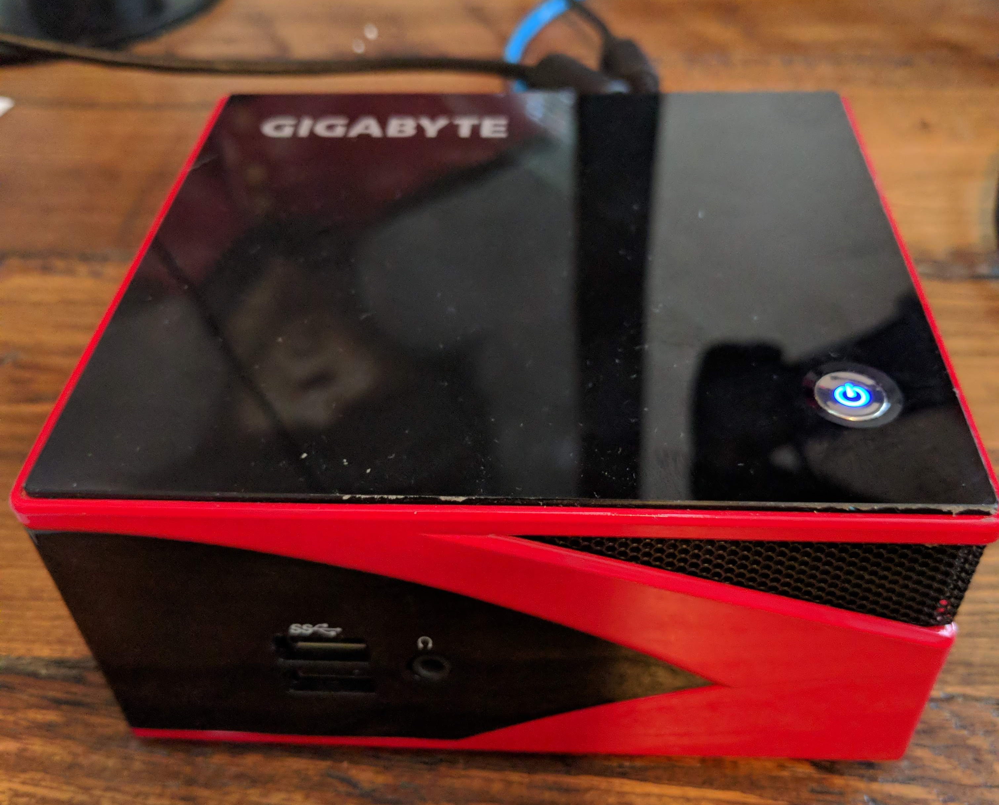
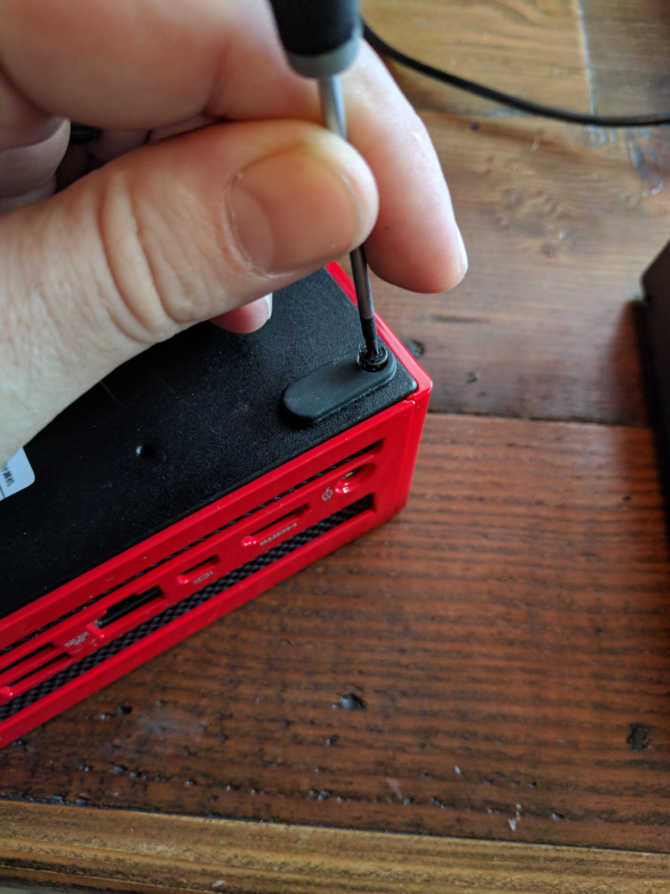
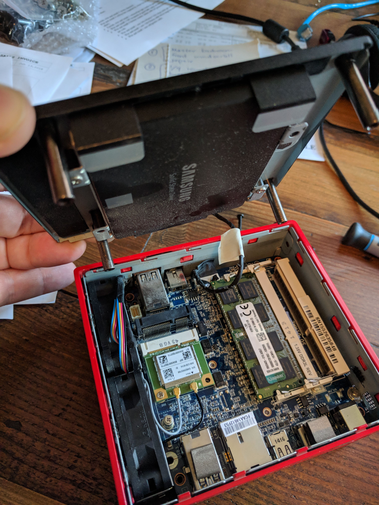
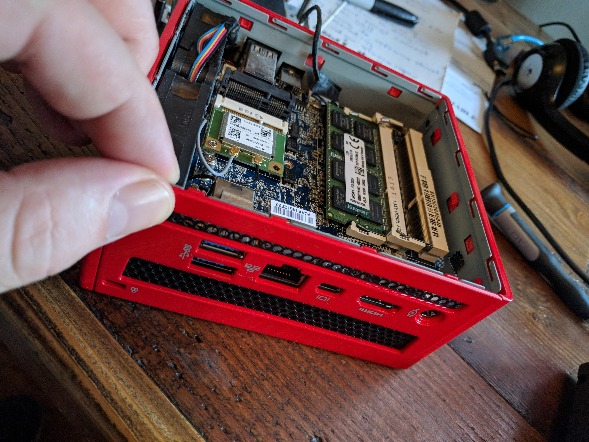
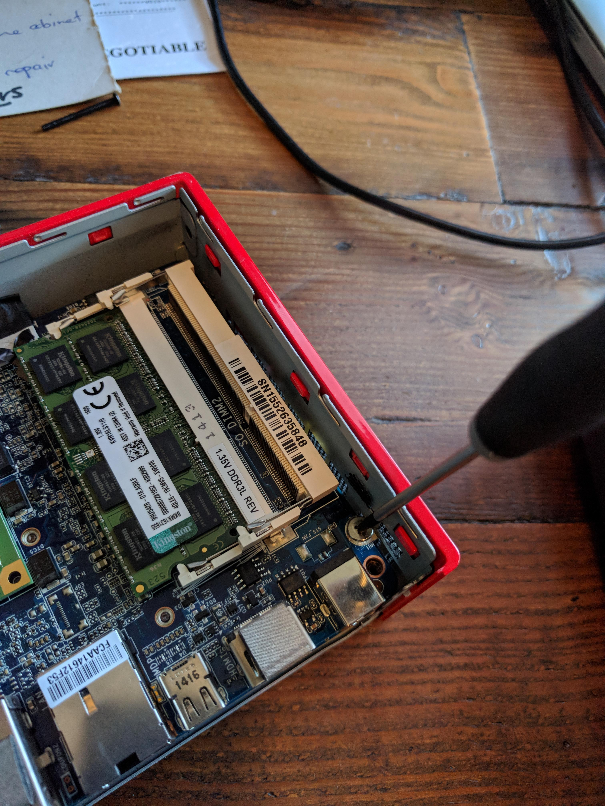
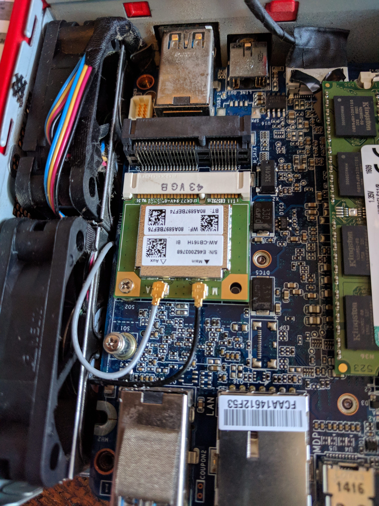
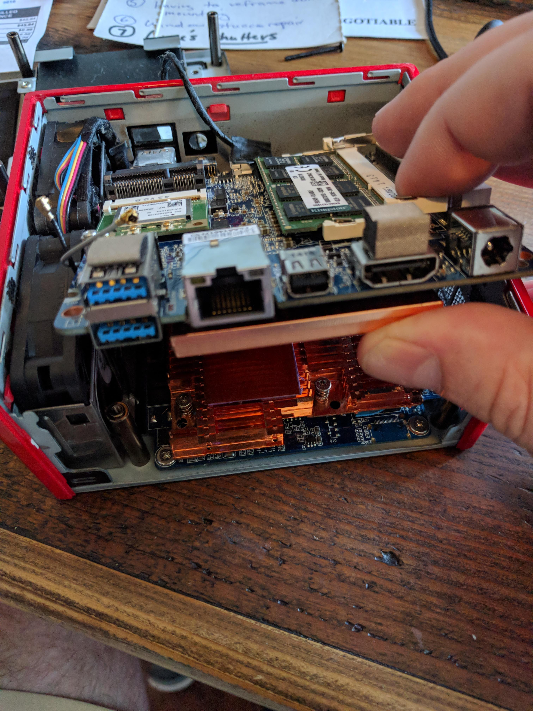
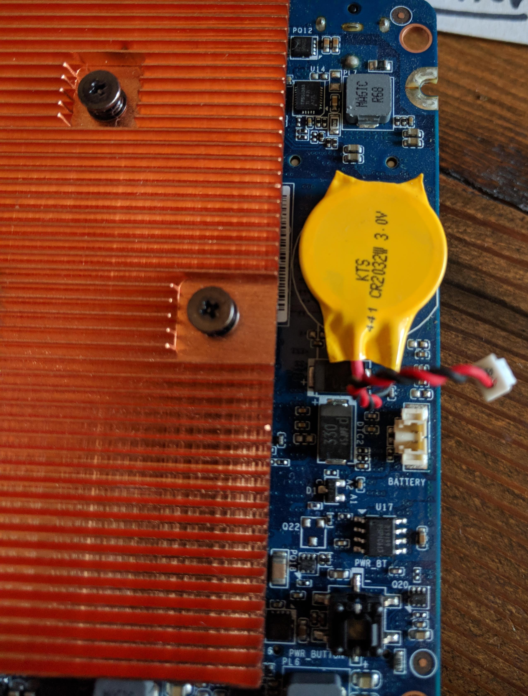

# How to reset the CMOS battery on a Gigabyte BRIX
## Or, how to break the ultra-fast boot prison

The Gigabyte BRIX is a nice little Intel NUC-like tiny form-factor piece of
hardware. The one I have is a little bit of an older model (GB-BXA8-5557 [1]) and
has an AMD A8-5557M integrated CPU and graphics processor with 4 cores and 8GB
RAM. It looks like this:

Recently, I wanted to re-image a Gigabyte BRIX machine for use as a MaaS rack
controller. The OS I had on there was Xubuntu 15.10 and I wanted to lay down a
brand new Ubuntu Desktop 18.04 image on it and start fresh.

Normally, the process of doing this is quite simple: burn the new operating
system image to a USB drive, place the USB drive in one of the USB ports on the
BRIX, and power-cycle. You should be able to hit the `Delete` key on power
cycle to tell the BRIX to enter the BIOS, at which point you can change the
boot order and set the USB drive to boot first.

In fact, this is how I remembered doing things the first time I set up the
BRIX. However, this time when I went to power cycle the hardware, the machine
would boot so quickly that it was impossible for me to enter the BIOS in order
to set the USB drive as the first boot (and therefore get to my new Ubuntu
install ISO).

Well, it turns out that at some point in the past couple years, I had (for some
unknown reason) toggled the ultra-fast boot option for the BRIX. I'm not sure
how or when I did this, and apparently it is a UEFI feature, not a BIOS
feature, but either way, the ultra-fast boot option essentially disabled my
ability to get to the BIOS at all and change the boot order. Consequently,
after about fifteen different frustrating attempts to hit the `Delete` key fast
enough on power cycle, I gave up and hit the Internets looking for a solution
to the "Can't get Gigabyte BRIX to display BIOS menu" problem.

Turns out that it's not possible to disable the ultra-fast boot option (in
Linux at least). You have to physically reset the [non-volatile BIOS
memory](https://en.wikipedia.org/wiki/Nonvolatile_BIOS_memory).

The BIOS memory is typically stored in something called "complementary
metal–oxide–semiconductor", or [CMOS](https://en.wikipedia.org/wiki/CMOS). The
CMOS allows a (very) small amount of data to be persisted even when power is
pulled from the circuitboard. However, in order to preserve this persistent
data, the CMOS uses a battery. In order to "reset the CMOS", you need to locate
this battery and remove it temporarily, which will cause the persistent data to
be reset to factory defaults.

This is a lot more involved than I had hoped, but I accomplished it and am
happy to report that my Gigabyte BRIX is now running on Ubuntu 18.04 after I
was able to get into the BIOS and change the boot order after resetting the
CMOS battery.

Since I was pretty frustrated at the lack of documentation (on both the
Gigabyte website as well as the Internet at large), I decided to write an
article about how to reset the CMOS battery on this particular hardware. Here
are the steps to take, along with pictures showing the actions to take and the
location of important bits.

### Step 1: Remove outer shell

First things first, you will of course want to disconnect all auxiliary
connectors as well as the main power cord.

Once you've disconnected everything attaching the BRIX to anything else
(including the power outlet), flip the little BRIX on its top, which will
expose the bottom of the outer casing. This outer casing will have four black
screws holding the shell to the inner casing. Remove all four screws.

Once you've removed the four screws, lift the bottom shell plate away from the
case. The bottom shell plate will most likely house an SSD drive along with the
drive connector to the motherboard. You should be able to gently set the bottom
plate to the side of the casing.

Once you've placed the bottom plate next to the case, remove the rear metal
panel by simply sliding it upwards. This will expose the side of the main
circuitboard which you will be removing shortly.

### Step 2: Remove circuitboard

Next, you will need to remove the circuitboard from the inner casing. The CMOS
battery that we will be temporarily disconnecting is on the underside of the
primary circuitboard (motherboard). In order to remove this circuitboard, there
is a single screw on the right side of the circuitboard, as shown in the
following picture. Unscrew this screw and place to the side.

Note that there are two wires labeled "main" and "aux" going into one of the
components on the top side of the circuitboard:

while you can complete the reset without detaching these wires, it's a little
tricky, so you can just gently pop each of those wires off before you slide the
primary circuitboard out.

Once the one screw is removed and you've detached the "main" and "aux" wires,
you will want to *gently* wiggle the circuitboard upwards and towards you.

### Step 3: Disconnect the CMOS battery

Once you've remove the primary circuitboard, turn it over and you will see the
bright yellow CMOS battery. Disconnect the tiny CMOS battery connector by
gently squeezing the inside of the connector and lifting.

Next, wait around 2-3 minutes. I have no idea on exactly how long one should
wait for the CMOS to be reset, but most things I found on the web indicate a
couple minutes or more.

### Step 4: Reattach and reassemble the hardware

Finally, go ahead and reassemble/reattach everything you've just disconnected. In order:

* Reconnect the CMOS battery
* Gently slip the primary circuitboard back in place
* Reattach the "main" and "aux" wires by gently and carefully slipping the
  connectors over the metal prongs for each wire
* Replace the inner screw that secures the primary circuitboard to the inner
  casing mold
* Slide the rear metal panel back into place
* Replace the bottom outer plate
* Replace the four outer screws holding the bottom plate to the case
* Reconnect all your peripherals
* Reconnect the power cord

Afterwards, you should be able to power on your BRIX, hit the `Delete` key
during power on and see the BIOS menu where you can change the boot order of
your machine!

[1]

The newest similar BRIX model with an AMD A8 processor is the [GB-BXA8-5545](https://www.gigabyte.com/us/Mini-PcBarebone/GB-BXA8-5545-rev-10).
I have no idea why the newer model has a lower model number (5545 vs my older
5557) but you'd have to ask Gigabyte about that.
