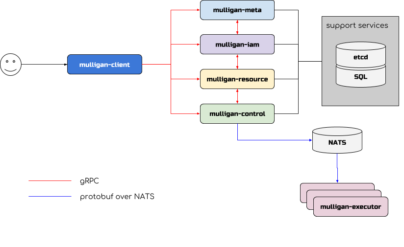

This is the second and final part of series describing Project Mulligan, the
OpenStack Redo. If you missed the [first part](mulligan.md) go read it. It is
about changes I'd make to the community and mission of OpenStack had I my way
with a theoretical reboot of the project.

In this part, I'll be discussing what I'd change about the **architecture**, **APIs** and
**technology choices** of OpenStack in the new world of Project Mulligan.

## A word on programming language

For those of you frothing like hyenas waiting to get into a religious battle
over programming languages, you will need to put your tongues back into your
skulls. I'm afraid you're going to be supremely disappointed by this post,
since I quite deliberately did not want to get into a Golang vs. Python vs.
Rust vs. Brainfuck debate.

Might as well get used to that feeling of disappointment now before going
further. Or, whatever, just stop reading if that's what you were hoping for.

For the record, shitty software can be written in any programming language.
Likewise, excellent software can be written in most programming languages. I
personally have a love/hate relationship with all three programming languages
that I code with on a weekly basis (Python, Golang, C++).

Regardless of which programming language might be chosen for Project Mulligan,
I doubt this love/hate relationship would change. At the end of the day, what
is most important is the communication mechanisms between components in a
distributed system and how various data is persisted. Programming language
matters in neither of those things. There are bindings in every programming
language for communicating over HTTP and for persisting and retrieving data
from various purpose-build data stores.

## Redoing the architecture

There are four areas of system design that I'd like to discuss in relation to
OpenStack and Project Mulligan:

* **component layout**: the topology of the system's components and how
  components communicate with each other
* **dependencies**: the technology choices a project makes regarding
  dependencies and implementation
* **pluggability**: the degree to which a project tolerates flexibility of
  underlying implementation
* **extensibility**: the degree to which a project enables being used in ways
  that the project was not originally intended

Before getting to Project Mulligan's architecture, let's first discuss the
architecture of OpenStack v1.

### OpenStack's architecture

OpenStack has no coherent architecture. Period.

Within OpenStack, different projects are designed in different ways, with the
individual contributors on a project team making decisions about how that
project is structured, what technologies should be dependencies, and how
opinionated the implementation should be (or conversely, how pluggable it
should be made)

Some projects, like Swift, are highly opinionated in their implementation and
design. Other projects, like Neutron, go out of their way to enable
extensibility and avoid making any sort of choice when it comes to underlying
implementation or hardware support.

#### Swift

Taking a further look at Swift, we see it is designed using a router-like
topology with a top-level Proxy server routing incoming client requests along
to various stand-alone daemon components fulfilling the needs of different
parts of the request (object storage/retrieval, container and account metadata
lookup, reaper and auditor workers, etc).

From a technology dependency point of view, Swift has very few.

There's no message queue. Instead, the (minimal) communication between certain
Swift internal service daemons is done via HTTP calls, and most Swift service
daemons push incoming work requests on to internal simple in-memory queues for
processing.

There is no centralized database either. Swift replicates SQLite database files
from one container/account server to another. These SQLite database files are
replicated between other nodes in the Swift system via shellout calls to the
`rsync` command-line tool,

Finally, the object servers require filesystems with xattr support in order to
do their work. While Swift can work with the OpenStack Identity service
(Keystone), it has no interdependency with any OpenStack service nor does it
utilitize any shared OpenStack library code (the OpenStack Oslo project).

Swift's authors built some minor pluggability into how some of their Python
backend classes were written, however pluggability is mostly not a priority in
Swift. I'm not really aware of anyone implementing out-of-tree
*implementations* for any of the Swift server code. Perhaps the Swift authors
might comment on this blog entry and let me know if that is incorrect or
outdated information.

Swift is not extensible in the sense that the core Swift software does not
enable the scope of Swift's API to extend beyond its core mission of being a
highly available distributed object storage system.

[Swift's API](https://developer.openstack.org/api-ref/object-store/) is a pure
data plane API. It is not a control plane API, meaning its API is not intended
to perform execution of actions against some controllable resources. Instead,
Swift's API is all about writing and reading data from one or more objects and
defining/managing the containers/accounts associated with those objects.

#### Neutron

Looking at Neutron, we see the opposite of Swift. From a component layout
perspective, we see a top-level API server that issues RPC calls to a set of
agent workers via a traditional brokered message bus.

There is a centralized database that stores object model information, however
much of Neutron's design is predicated on a plugin system that does the actual
work of wiring up an L2 network. Layer 3 networking in Neutron always felt like
it was bolted on and not really part of Neutron's natural worldview. [1]

Neutron's list of dependencies is broad and is influenced by the hardware and
vendor technology a deployer chooses for actually configuring networks and
ports. Its use of the common OpenStack Oslo Python libraries is
[extensive](https://github.com/openstack/neutron/blob/master/requirements.txt#L27-L43),
as its dependency on a raft of other Python libraries. It communicates directly
(and therefore has a direct relationship) with the OpenStack Nova and Designate
projects, and it depends on the OpenStack Keystone project for identity,
authentication and authorization information.

Nearly everything about Neutron is both pluggable and extensible. Everything
seems to be a driver or plugin or API extension [2]. While there is a top-level
API server, in many deployments it does little more than forward requests on to
a proprietary vendor driver that does "the real work", with the driver or
plugin (hopefully [3]) saving some information about the work it did in
Neutron's database.

The "modular L2 plugin" (ML2) system is a framework for allowing mechanism
drivers that live outside of Neutron's source tree to perform the work of
creating and plugging layer-2 ports, networks, and subnets. Within the Neutron
source tree, there are some base [mechanism
drivers](https://github.com/openstack/neutron/tree/master/neutron/plugins/ml2/drivers)
that enable software-defined networking using various technologies like Linux
bridges or OpenVSwitch.

This means that every vendor offering software-defined networking functionality
has its own ML2 plugin (or more than one plugin) along with separate drivers
for its own proprietary technology that essentially translate the Neutron
worldview into the vendor's proprietary system's worldview (and back again).
And example of this is the Cisco Neutron ML2 plugin which has [mechanism drivers](https://github.com/openstack/networking-cisco/tree/master/networking_cisco/ml2_drivers)
that speak the various Cisco-flavored networking.

One nice relatively recent development in Neutron is the separation of many
"common" API constructs and machinery into the
[neutron-lib](https://github.com/openstack/neutron-lib) repository. This at
least goes part way towards reducing some duplicative code and allowing out of
tree source repositories to import a much smaller footprint than the entire
Neutron source tree.

On the topic of extensibility in Neutron's API, I'd like to point to Neutron's
[own documentation on its API extensions](https://developer.openstack.org/api-ref/network/v2/#id5), which
states the following:

    The purpose of Networking API v2.0 extensions is to:

    - Introduce new features in the API without requiring a version change.
    - Introduce vendor-specific niche functionality.
    - Act as a proving ground for experimental functionalities that might be
      included in a future version of the API.

I'll discuss a bit more in the section below on Project Mulligan's API, but I'm
not a fan of API extensibility as seen in Neutron. It essentially encourages a
Wild West mentality where there is no consistency between API resources, no
coherent connection between various resources exposed by the API, and a
proliferation of vendor-centric implementation details leaking out of the API
itself. Neutron's API is not the only OpenStack project API to succumb to these
problems, though. Not by a long shot.

#### Nova

Still other projects, like the OpenStack Nova project, have dependencies on
traditional databases and brokered message queues, a component layout that was
designed to address a specific scale problem but causes many other problems and
a confusing blend of highly extensible, sometimes extensible, and
extensible-in-name-only approaches to underlying technology choices.

Nova's component layout features a top-level API server, similar to Neutron and
Swift. From there, however, there's virtually nothing the same about Nova. Nova
uses a system of "cells" which are designed as scaling domains for the
technology underpinning Nova's component communications: a brokered message
queue for communicating between various system services and a traditional
relational database system for storing and retrieving state.

Take old skool RPC with all the operational pitfalls and headaches of using
RabbitMQ and AMQP. Then tack on eight years of abusing the database for more
than relational data and horrible database schema inefficiencies. Finally,
overcomplicate both database connectivity and data migration because of a
couple operators' poor choices and inexperienced developers early in
the development of Nova. And you've got the ball of spaghetti that Nova's
component layout and technology choice currently entails.

As for Nova's extensibility, it varies. There is a virt driver interface that
allows different hypervisors (and Ironic for baremetal) to perform the
on-compute-node actions needed to start, stop, pause and terminate a VM
instance. There are some out-of-tree virt drivers that ostensibly try to keep
up with the virt driver interface, but it isn't technically public so it's
mostly a "use with caution and good luck with that" affair. The scheduler
component in Nova used to be ludicrously extensible, with support for all sorts
of out-of-tree filters, weighers, even whole replacement scheduler drivers.
That sucked, since there was no way to change anything without breaking the
world. So now, we've removed a good deal of the extensibility in the scheduler
in order to return some level of sanity there.

Similarly, we used to give operators the ability to whole-hog replace entire
subsystems like the networking driver with an out-of-tree driver of their own
making. We no longer allow this kind of madness. Neutron is the only supported
networking driver at this time. Same for volume management. Cinder is the one
and only supported volume manager.

## OK, so what does Project Mulligan look like?

For Project Mulligan, we'll be throwing out pretty much everything and starting
over. So, out with the chaos and inconsistency. In with sensibility, simplicity
and far fewer plug and extension points.

Now that Project Mulligan's scope has been healthily trimmed, we can focus on
only the components and requirements for a simple machine provisioning system.

Project Mulligan will be composed of a number of components with well-defined
scopes:

* A **smart client** (`mulligan-client`) that can itself communicate with all
  Mulligan service daemons without needing to go through any central API or
  proxy service
* An **account service** (`mulligan-iam`) providing identity and account
  management functionality
* A **metadata service** (`mulligan-meta`) provides lookup and translation
  service for common object names, tags and key/value items
* An **inventory management service** (`mulligan-resource`) is responsible for
  tracking the resources discovered in an environment and providing a simple
  placement and reservation engine
* A **control service** (`mulligan-control`) that can take an incoming request
  to provision or decommission a machine and send a work request to a task
  queue
* **executors** (`mulligan-executor`) will read task requests from a queue and
  performing that task, such as booting a machine or configuring a machine's
  networking

What about the technologies that Project Mulligan will be dependent upon?

I'm envisioning the following dependencies:

* [etcd](https://github.com/coreos/etcd) for storing various pieces of information and being the
  notification/watch engine for all services in Project Mulligan.
* A relational database server for storing highly relational data that needs to
  be efficiently queried in aggregate
* [NATS](https://www.nats.io/) for a simple task based queue service that the
  executors will pop tasks from

From a birdseye view, the topology of Project Mulligan and its components and
dependent low-level services looks like this:

All Project Mulligan services and workers will be entirely stateless. All state
will be persisted to either `etcd` or a RDBMS.

### The account service

In order to provide multi-tenancy from the start, Project Mulligan clearly
needs a service that will provide account and identity management support. If
OpenStack Keystone were a separate, stand-alone service that had a gRPC API
interface, we'd use that. But since it's not, we'll have to write our own from
scratch, potentially with an adapter that understands the useful part of the
OpenStack Keystone REST API -- you know, users, projects and roles
(assignments). The rest of the Keystone API, including the hand-rolled token
API, would be cut out. Application credentials would stay but would just be a
type of account instead of a separate thing that lived under the user resource.

We'll use JSON Web Tokens (JWT) as the payload format for any authorization
tokens that need to be passed between Project Mulligan service endpoints (or
outside to external endpoints).

### The metadata service

All objects in the Project Mulligan system will be identified by a UUID.
However, as we all know, remembering UUIDs and passing them around manually is
a pain in the ass. So, we need a way of associating a unique name and URI-clean
slug with an object in the system. The metadata service will provide a simple
UUID -> name or slug lookup (and reverse lookup) service. Data stores for
individual services, whether those data stores be SQL databases or not, will
not store any name or slug information. Only UUID keys for objects that the
service controls. The metadata service will act as a cache for this kind of
name/slug identifying information. It will be backed by an `etcd` data store.

The second purpose of the metadata service will be to store and retrieve two
other kinds of information decorating objects in the system:

* **tags**: these are simple strings that are settable on any object in the
  system and are not validated or protected in any way
* **metadefs**: these are specific named attributes that may be defined by the
  system or an end user, protected against changes and given a validation
  schema

If you're familiar with the OpenStack [Glance Metadefs](https://docs.openstack.org/glance/pike/user/glancemetadefcatalogapi.html)
concept, that's pretty much what the second item is.

### The resource service

How resources are tracked, claimed and consumed in a software system is a
critical concept to get *right*, and get right from the start. If there's one
thing I've learned working on the scheduler and placement services in
OpenStack, it's that the consistency and accuracy of the data that goes into an
inventory management system dictates the quality of all systems built on top of
that data, including capacity management, billing, reservations,
scheduling/placement and quota management.

You need to accurately and efficiently represent both the **structure** of the
resources and providers of resources within the system as well as the
**process** by which those resources are consumed by users of the system.

You cannot build a quality resource management system on top of a free-for-all
land-grab where each vendor essentially redefines its notion of what a resource
is. It was tried in OpenStack Nova. It failed and is still causing headaches
today. Vendors have shifted their focus from the scorched Earth they've left
behind in OpenStack for the new fertile hype-hunting grounds of Kubernetes,
with Intel and NVIDIA pushing for [more](https://docs.google.com/document/d/1EZQJdV9OObt8rA2epZDDLDVtoIAUQrqEZHy4oku0MFk/edit?ts=5b2aa70b#) and [more](https://github.com/NVIDIA/k8s-device-plugin) extensibility in how they track
[resource](https://kubernetes.io/docs/concepts/configuration/manage-compute-resources-container/#extended-resources) inventory and consumption. With that extensibility comes a complete
lack of interoperability and, unless the Kubernetes community is very careful,
a quagmire of unmaintainable code.

Project Mulligan's resource management service will be responsible for storing
inventory information for resource providers in the system. The structure and
relationship of providers to each other will also be the purview of the
resource management service. In other words, the resource management service
will understand groups of providers, trees of providers, relative distances
between providers, etc.

The process by which consumers of resources request those resources is called a
**resource claim**. I've come to realize over the last four years or so that
the system that handles the consumption and claiming of resources must be able
to understand the temporal aspects of the resource request as well as the
quantitative aspects of the request. What this means is that I believe the
system that doles out resources to consumers of those resources needs to
implement a resource reservation system itself. After all, a resource
reservation system is simply a resource allocation system with an extra
temporal dimension. Storing this temporal data along with inventory and usage
information makes the most natural sense from a systems design perspective.

So, good news for the [OpenStack Blazar](https://docs.openstack.org/blazar/latest/)
project, your functionality is going to be subsumed by the Project Mulligan
resource management service.

### The control service and executors

The control service will be nothing more than a place to send command requests.
These command requests will be validated by the control service and then
packaged up into tasks that get pushed onto a simple queue managed by NATS.

The executors will pull a task off the task queue and execute it, sending the
results of the task back on to a separate results queue. The results queue will
be processed by an executor whose job will be to simply save the results state
to some data store.

## Redoing the API

A project's API is its primary user interface. As such, its API is critically
important to both the success of the project as well as the project's perceived
quality and ease of use.

There is no REST API in Project Mulligan. Only gRPC APIs are supported.

The reason for this choice is that gRPC is versioned from the get-go with a
sane set of clear rules for describing the evolution of the request and
response payloads.

No more inane and endless debates about "proper" REST-ness or HATEOS or which
HTTP code thought up in the 1990s is more appropriate for describing a
particular application failure.

No more trying to shoehorn a control plane API into a data plane API or vice
versa.

Astute readers will note that there is no top-level API or proxy server in
Project Mulligan.

However, this doesn't mean that there isn't a Project Mulligan public API. The
Project Mulligan API is simply the set of gRPC API methods exposed by Project
Mulligan's gRPC service components. What is *not* part of Project Mulligan's
public API are the internal task payload formats that get sent from the
`mulligan-control` service to the NATS queue(s) for eventual processing by a
`mulligan-executor` worker.

The key to making this work is developing a smart client program that contains
much of the catalog, service mesh and route-dispatching functionality that a
traditional top-level API or proxy server would contain.

The problem with embedding a lot of logic into client programs, though, is that
you need to duplicate that logic for each programming language binding you
create. I recognize this is an issue. To address it, Project Mulligan will
automatically generate this core routing logic code and generate smart clients
in a variety of programming languages as part of its automated build process.

Call me crazy, I know... but gRPC, in combination with Google Protocol Buffers'
`protoc` compiler does this exact thing: it generates a client and server
binding for whatever programming language you want after looking at the
`.proto` files that describe an interface.

### What about extensibility?

I'm not interested in having Project Mulligan become a generic framework for
constructing cloud applications. I'm not interested in allowing Project
Mulligan's scope and purpose to be extended or redefined by adding API
abstraction machinery ala Kubernetes custom resource definitions (CRDs) to
Project Mulligan.

Project Mulligan is what it is: a simple machine provisioning system. It's not
designed to be extensible. It should do one thing and do that thing cleanly,
simply and efficiently.

If you want a framework for creating something that isn't machine provisioning,
feel free to go use Kubernetes' CRDs. Note that you'll still need Kubernetes to
be installed on some machines somewhere. After all, code needs to run on a
machine. And Project Mulligan is all about demystifying that process of
provisioning machines.

## Important things to get right, from the beginning

Here are a few things that I think need to be done correctly, right from the
start of Project Mulligan.

* Installation and configuration
* In-place updates and re-configuration
* Multi-tenancy and isolation
* Partitioning and failure domains

### Install and configuration

Project Mulligan will be able to be installed via traditional software package
managers like apt or yum on Linux.

In addition to traditional software packages, we'll build Docker images for the
various service components.

If an organization has already deployed a container orchestration system like
Kubernetes and wants to deploy Project Mulligan in a highly-available manner,
they can consume these Docker images and build their own Helm charts for
deploying Project Mulligan.

Configuration of Project Mulligan should be as easy as possible. There should
be no need for hundreds of configuration options and a simple bootstrapping
command from the `mulligan-client` should be enough to get a working system up
and running.

### In-place updates and re-configuration

Project Mulligan's components should be able to be updated in-place and
separately from each other, with no ordering dependencies.

Each component should respond to a SIGTERM with a graceful shutdown of the
process, draining any queued work properly.

When the component's package is upgraded and the component restarted, the gRPC
server contained within the component will likely contain a newer version of
gRPC API request payloads. Because of the [way gRPC method versioning works](https://www.beautifulcode.co/backward-and-forward-compatibility-protobuf-versioning-serialization),
other components (or the smart clients) that communicate with the component
will continue to be sending request payloads formatted for an older version of
the component's API method. The upgraded server component will respond to the
older clients with the message format the older client expects. This will
facilitate Project Mulligan's components being upgraded without any ordering
dependency.

I *really* like OpenStack Swift's approach to upgrades. There are no separate
administrative commands for performing database schema migrations. No separate
utility for performing data migrations. Everything is simply handled within the
controllers themselves, with the controllers [executing SQL commands](https://github.com/openstack/swift/blob/86d78f6667392b2ee0ca017da8f54ff153aca491/swift/container/backend.py#L1532-L1572) to migrate
the schema forward as needed.

Much more operator-friendly than having a separate `nova-manage db sync &&
nova-manage api_db sync && nova-manage db online_data_migrations --max-count=X`
way of performing simple forward-only schema and data migrations.

Re-configuring a running Project Mulligan component should be possible in order
to tinker with runtime settings like log output verbosity. In order to
facilitate this runtime re-configuration, each Project Mulligan service
component will have a gRPC API method called `$ServiceConfigure()` that accepts
a set of configuration options that are tunable at runtime.

### Multi-tenancy and isolation

From the beginning, nearly all [4] OpenStack components were designed for
multi-tenancy. This means the systems are designed for multiple groups of one
or more users to simultaneously utilize the service without impact to each
other.

The actions those users take should not impact other users of the system, nor
should the resources owned by one user have any access to resources owned by
another user. In other words, by default, strong isolation exists between
tenants of the system.

Project Mulligan will likewise be built from the ground up with multi-tenancy
as a design tenet. Resources should be wholly owned by a tenant (group of
users) and isolated from each other.

### Partitioning and failure domains

Project Mulligan should have clear and concise definitions of the ways in which
the system itself may be divided -- both for reasons of scale as well as for
limiting a failure's effects.

This implies that all objects in the system should have an attribute that
describes the shard or partition that the object "lives in".

Kubernetes refers to a collection of controllers and nodes as a "cluster",
which is the closest concept it has [5] to a system partition or shard. There
is no geographic nor failure domain connotation to a Kubernetes cluster.

OpenStack unfortunately has no consistent terminology nor model of
partitioning. Some services have the concept of an "availability zone".
However, as [I've noted](http://lists.openstack.org/pipermail/openstack-dev/2014-March/031106.html) on the openstack-dev mailing list before, the OpenStack
term of "availability zone" is a complete pile of vestigial poo that should be
flushed down the sewer pipes.

In Project Mulligan, we'll call this partitioning concept a "region". Regions
may be hierarchical in nature, and there need not be a single root region.
Regions may indicate via attributes what users should expect with regards to
failure of various systems -- power, network, etc -- and their impact on other
regions. Regions will have attributes that indicate their visibility to users,
allowing both internal and external partitions of the system to be managed
jointly but advertised separately.

## Conclusion

In case it hasn't become obvious by now, Project Mulligan isn't OpenStack v2.
It's a complete change of direction, an entirely trimmed and reworked vision of
a very small chunk of what today's OpenStack services are.

Is this better than slow, incremental backwards-compatible changes to OpenStack
v1, as [some have suggested](http://lists.openstack.org/pipermail/openstack-dev/2018-July/131961.html)? I have no idea. But I'm damn sure it will be more
fun to work on. And isn't that what life is really all about?

Thanks for reading.

-jay

## Footnotes

[1] This makes perfect sense considering the origins of the Neutron project,
which was founded by folks from Nicira which ended up as VMWare's NSX
technology -- an L2-centric software defined networking technology. FYI, some
of those same people are the driving force behind the Cilium project that is
now showing promise in the container world. Isn't it great to be able to walk
away from your original ideas (granted, after a nice hiatus) and totally
re-start without any of the baggage of the original stuff you wrote? I agree,
which is why Project Mulligan will be a resounding success.

[2] Even the comically-named "[core extensions](https://github.com/openstack/neutron/tree/master/neutron/core_extensions)".
*sigh*.

[3] The base Neutron plugin actually allows the plugin to not use Neutron's
database for state persistence, which is basically the Neutron authors
relenting to vendor pressure to just have Neutron be a very thin shim over some
proprietary network administration technology -- like [Juniper Contrail](https://github.com/Juniper/contrail-neutron-plugin).

[4] One the largest, most glaring exceptions to this multi-tenancy rule,
unfortunately is OpenStack Ironic, the baremetal provisioning system.

[5] Kubernetes actually doesn't really define a "cluster" to be something
specific, unlike many other terms and concepts that Kubernetes *does* define --
like Pod, Deployment, etc. The term "cluster" seems to be just something the
Kubernetes community landed on to refer to a collection of nodes comprising a
single control plane...
