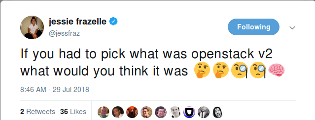

Jess Frazelle's [tweet](https://twitter.com/jessfraz/status/1023550446026276864) recently got me thinking. [1]

What if I could go back and undo basically the last eight years and remake
OpenStack (whatever "OpenStack" has come to entail)? What if we could have a
big do-over?

In this two-part blog post, I will be describing "Project Mulligan", the
OpenStack Redo.

This first post is about **mission**, **scope**, **community**, and
**governance**.

The [second part](mulligan-architecture.md) is all about the **architecture**
and **technology choices** that Project Mulligan will employ.

This is obviously a highly opinionated reflection on what I **personally** would
change about the world I've lived in for nearly a decade.

I'm bound to offend lots of people along the way in both the OpenStack and
Kubernetes communities. Sorry in advance. Try not to take things personally --
in many cases I'm referring as much to myself as anyone else and so feel free
to join me on this self-deprecating journey.

## Background

I've been involved in the OpenStack community for more than eight years now.
I've worked for five different companies on OpenStack and cloud-related
projects, with a focus on compute infrastructure (as opposed to network or
storage infrastructure). I've been on the [OpenStack Technical Committee](https://www.openstack.org/foundation/tech-committee/), served
as a Project Team Lead (PTL) and am on a number of core reviewer teams.

When it comes to technical knowledge, I consider myself a journeyman. I'm never
the smartest person in the room, but I'm not afraid to share an opinion that
comes from a couple decades of programming experience.

I've also managed community relations for an open source company, given and
listened to lots of talks at conferences, and met a whole bunch of really smart
and talented individuals in my time in the community.

All this to say that I feel I do have the required background and knowledge to
at least put forth a coherent vision for Project Mulligan and that *I am as much
responsible as anyone else for the mess that OpenStack has become*.

## Redoing the mission

When OpenStack began, we dreamt big. The mission of OpenStack was big, bold and
screamed of self-confidence. We wanted to create **an open source cloud
operating system**.

The #1 goal in those days was expansion. Specifically, expansion of **user
footprint** and **industry mindshare**. It was all about quantity versus
quality. Get as much of the pie as possible.

As time rolled on, the mission got wordier, but remained as massive and vague
as "cloud operating system" ever was. In 2013, the mission looked like this:

> to produce the ubiquitous Open Source Cloud Computing platform that will meet the needs of public and private clouds regardless of size, by being simple to implement and massively scalable.

See the word "ubiquitous" in there? That pretty much sums up what OpenStack's
mission has been since the beginning: *get installed in as many places as
possible*.

While "simple to implement" and "massively scalable" were aspirational, neither
were realistic and both were subject to interpretation (though I think it is
safe to say OpenStack has never been "simple to implement").

Today, the mission continues to be ludicrously broad, vague, and open-ended, to
the point that it's impossible to tell what OpenStack ***is*** by reading the
mission:

> to produce a ubiquitous Open Source Cloud Computing platform that is easy to use, simple to implement, interoperable between deployments, works well at all scales, and meets the needs of users and operators of both public and private clouds.

"Meets the needs of users and operators of both public and private clouds" is
about as immeasurable of a thing as I can think of. Again, it's aspirational,
but so broad as to be meaningless outside anything but the most abstract
discussions.

Project Mulligan is getting a new mission in life:

> demystify the process of provisioning compute infrastructure

It's aspirational but not open-ended; singularly focused on the compute
provisioning process.

Why "demystify"?

Despite "easy to use" and "simple to implement" being in OpenStack's current
mission, I believe OpenStack v1 has utterly failed to simplify a complex and
often burdensome process. In contrast, OpenStack v1 has made a complex process
(of provisioning infrastructure pieces) *even more convoluted and error-prone*.

If you ask me *why* I think OpenStack v1 has failed to deliver on these aspects
of its mission, my response is that OpenStack v1 doesn't know what it wants to
be.

It has no identity other than being open and welcoming to anyone and everyone
that wants to jump on the Great Cloud Bandwagon in the Sky. [2]

And because of this identity crisis, there is zero focus on any one particaular
thing.

Well, that ends with Project Mulligan.

Project Mulligan isn't trying to be a "cloud operating system". Heck, it
doesn't even care what "cloud" *is*. Or isn't.  Or might be in the future for a
DevOpsSysAdminUserator.

"OK, Jay, but what really *IS* 'compute infrastructure'?"

I'm glad you asked, because that's a perfect segue into a discussion about the
scope of Project Mulligan.

## Redoing the scope

Defining the scope of OpenStack is like attempting to bathe a mud-soaked cat in
a bubble bath -- a slippery affair that only ends up getting the bather muddy
and angering the cat.

The scope of OpenStack escapes definition due to the sheer expanse of
OpenStack's mission.

Now that we've slashed Project Mulligan's mission like Freddy Krueger on
holiday in a paper factory, defining the scope of Project Mulligan is a much
easier task.

We're going to start with a relatively tiny scope (compared to OpenStack v1's),
and if the demand is there, we'll expand it later. Maybe. If I'm offered enough
chocolate chip cookies.

The scope of Project Mulligan is:

> singular baremetal and virtual machine resource provisioning

I've chosen each word in the above scope carefully.

> singular

"singular" was chosen to make it clear that Project Mulligan doesn't attempt to
provision multiple identical things in the same operation.

> baremetal and virtual machine

"baremetal and virtual machine" was selected to disambiguate Project Mulligan's
target deployment unit. It's not containers. It's not applications. It's not
lambda functions. It's not unikernels or ACIs or OCIs or OVFs or debs or RPMs
or Helm Charts or any other type of package.

Project Mulligan's target deployment unit is a **machine** -- either baremetal
or virtual.

A machine is what is required to run some code on. Containers, cgroups,
namespaces, applications, packages, and yes, serverless/lambda functions
require a machine to run on. That's what Project Mulligan targets: the machine.

> resource

The word "resource" was used for good reason: a resource is something that is
used or consumed by some other system. How those systems describe, request,
claim and ultimately consume resources is such a core concept in any software
system that extreme care must be taken to ensure that the mechanics of resource
management are done *right*, and done in a way that doesn't hinder the creation
of higher-level systems and platforms that utilize resource and usage
information (like quota management and reservation systems, for example).

I go into a lot of detail below in the second part of this blog post on
"Redoing the architecture" about resource management and why it's important to
be part of Project Mulligan.

> provisioning

At its core, the purpose of Project Mulligan is to demystify the arcane and
hideously complex process inherent in provisioning machines. Provisioning
involves the setup and activation of the machine. It does not involve
operational support of the machine, nor does it involve moving the machine,
restarting it, pausing it, or throwing it a birthday party.

The *only* things that are important to be in Project Mulligan's scope are the
items that enable its mission and that cannot be fulfilled by other existing
libraries or systems in a coherent way.

From an interface perspective, this means the scope of Project Mulligan is the
following:

* Disovering and managing hardware inventory (these are the resources that
  will be provided to consumers of Project Mulligan's APIs)
* Requesting, claiming and ultimately consuming those machine resources

That's pretty much it.

I imagine at this point, I've offended more than three quarters of the universe
by not including in Project Mulligan's scope any of the following:

* Object storage
* Network provisioning and management
* Containers
* Security
* Orchestration
* Filesystems
* Deployment automation
* Configuration management
* AmigaOS

Are these things important? Yep. Well, OK, maybe not AmigaOS. Do I want them in
Project Mulligan's mission statement or scope? No. No, I don't.

## Redoing the community

I have a number of thoughts about matters of community. My views on the subject
have changed -- and continue to change. These views vary depending on the day
of the week, whether I'm currently taking anti-depressants, and whether I've
happened to upset more than three people in the last 24 hours while reviewing
their code.

After witnessing and participating in eight years of OpenStack's governance
style, I'm eager for a change. Well, actually, a number of changes, presented
here in no particular order.

### Less talk, more do

I know that some colleagues in the community adore lengthy conversations on IRC
and mailing list posts that meander around like a bored teenager on Quaaludes.

However, I'm tired of talking. I want to see some action taken that really
kicks Project Mulligan into high gear.

We need a Linus Torvalds [3] for Project Mulligan. A no-bullshit, this is how
it's gonna be, type of person who is willing to say "oh fuck no" when needed.
[4]

Hell, let's have *three* of these not-necessarily-benevolent dictators. That
way they can share the grief and bear the brunt of inevitable criticism that
will pour forth from those who seek to commandeer Project Mulligan for their
own devices.

Speaking of that, let's talk a bit about vendors.

### Vendors should wear helmets

Vendors should be required to wear helmets at all times when visiting Project
Mulligan. And not some silly London bobby helmet. I'm talking about those
bright yellow construction helmets that both **announce intentions** as well
as **protect brain matter**.

Nothing gets my goat more than a vendor that isn't up front about their
vendory-ness.

Is it too much for me to want to hear, just once, "hey, I'm aware this feature
is a pet project of mine and really only helps me out".

Or better yet, "yeah, I understand that this project is made up entirely of my
own internal engineers and really its just a way for us to protect our
intellectual property by being first to market and (ab)using the open source
ecosystem for marketing and hiring advantages".

Unfortunately, all too often, vendors pretend like there's nothing to see here;
move along...

I am sure that as people read this, some folks are thinking, "Hmm, am *I* a
vendor?"

Well, you might be a vendor if...

* You only ask for features that further your own company's objectives
* You cannot articulate why anyone other than your company would want a feature
* You don't review code outside of your own company
* You only work on code for a driver to enable your own company's technology
* If you provide any documentation links at all, you can only provide links to
  internal documentation that first needs to go through legal review in order
  for that link to be made public

"But Jay, 95% of contributors to OpenStack work at some company that pays them
to write code or work on deployment stuff for OpenStack. Don't shit where you
eat, my friend."

Yes, you're absolutely correct about that, my friend. And thank you for being
concerned about my digestive system.

That said, being "a vendor" is exhibiting a certain set of behaviours when
participating (or not) in an open source community. Being "a vendor" doesn't
mean "you work for a company".

I'm afraid to be the bearer of bad news, but Project Mulligan, unlike
OpenStack, isn't going to cater to the vendors.

Project Mulligan won't kick vendors out, but at the same time, we're not going
to go out of our way to deify "Platinum Members" or any such silliness. Vendors
are free to take Project Mulligan's source code and use it for their own
products, but the Project Mulligan community won't be spending its time
promoting those products, developing "certification" policies for vendors to
work towards, or attempting to cozy up to vendor-centric trade organizations
that aren't particularly related to the core mission of Project Mulligan.

Which brings me to something that bothers me about Kubernetes, from a community
perspective.

Many questions on the Kubernetes user mailing list seem to be for specific
vendor *products* -- i.e. Google Cloud Platform, Google Kubernetes Engine, Red
Hat OpenShift [5], etc -- instead of being about Kubernetes itself. This is
indicative of the tight coupling between the Kubernetes project and the vendors
that host a Kubernetes SaaS offering.

While there are occasionally questions on the OpenStack mailing lists about a
particular distribution of OpenStack -- Mirantis OpenStack/Fuel, Red Hat
OpenStack Platform or RDO, etc -- not only are these questions rare, but they
are often answered with pointers to the vendor's support organization or bug
tracker. In addition, you don't see questions about getting support for one of
the public clouds that run OpenStack.

This doesn't seem to be the case for Kubernetes, where the vendored SaaS
offerings don't seem to be distinguishable from the open source project itself.
Or at least, they don't seem to be distinguishable for a great number of
Kubernetes users. And the engineers working at the primary Kubernetes vendors
don't seem to have much of a problem with this equating of a product with the
open source project that underpins those products.

### Releases and time-based release cycles

It seems to me that coordinated releases are merely designed to coincide with
the OpenStack Summit marketing events. I see no benefit whatsoever to
time-based release cycles other than for marketing coordination purposes.

The time-based release cycles set artificial deadlines and freeze dates for no
good reason and just end up placing a bunch of bureaucratic red tape and
slowing to a crawl a process that frankly should be a simple thing that can be
done (in a fully automated fashion) whenever necessary.

[OpenStack Swift](https://docs.openstack.org/swift/latest/) has been doing
[non-time-based releases](https://wiki.openstack.org/wiki/Swift/version_map)
this way for more than 8 years, eschewing the time-based release mechanics that
most of the rest of OpenStack projects follow in favor of just tagging their
source repository with a version tag when they feel that a certain fix or
feature warrants a new release tag.  And it works perfectly fine for Swift. The
Swift project's sensible decoupling and reliance on far fewer inter-project
dependencies makes this possible.

I don't see operators clamouring for a six-month release cycle -- jeez, most
operators have so much internal integration and legacy junk that they move at
the speed of molasses with regards to migrating to more modern OpenStack
releases. All operators care about is can they get from their old-ass version
to some less old-ass version of their deployed software in a way that doesn't
result in too much downtime for their users.

I also don't care about long-term support (LTS) releases. If distributions want
to support those, they should feel free to do so. Many distributions make lots
of money selling FUD about software that changes too quickly for their legacy
customers to "handle in the way they've become accustomed". So, it seems fair
to me to have those vendors fully own their own LTS release processes and spend
the money to maintain that code. I personally don't feel it should be something
an upstream development community should be involved in.

Therefore, Project Mulligan won't be following a time-based release cycle.
There will be no "spec freeze dates", no "code freeze dates", no "dependent
library freezes", no "milestone releases". None of that.

When a feature or set of bug fixes warrants a "release", then the source
repository will get a new tag which will trigger the automated build of release
artifacts. No red tape, no freeze dates.

Who gets to decide what "warrants a release"? Anyone should be able to propose
that the source repository be tagged for release. If there are no objections
from anyone in the contributor community, one of the core committers can
trigger the release by pushing a tag. Simple is that.

### Conferences and foundations

There are plenty people who like the large OpenStack Summit conferences.

I am not one of those people.

I have not attended the last two OpenStack summits; instead I've chosen to
stick to the OpenStack Project Team Gathering events that are strictly for
developers to discuss implementation proposals and brainstorm system design.

Perhaps this is because I remember the very first OpenStack Design Summit in
Austin, Texas. There were about 150 engineers there, if I recall correctly. We
discussed implementation possibilities, design choices, how to test Python
software properly, how to set up an automated testing infrastructure system,
and how to organize developers who were just beginning to come together around
infrastructure software.

That first get-together, and the developer events that followed for the next
couple years or so (until the OpenStack Foundation became a thing), were
modeled after the successful Ubuntu Design Summit (UDS) concept where
contributors to the Ubuntu Linux distribution would get together every six
months to decide what would be the focus of the next release, what were the
implementation proposals for various system pieces, and what decisions needed
to be made to further the distribution.

The entire **purpose** of the original design summits was to be a **working
event**. There were no presentations, no vendor displays, no sales people
mixing with engineers. It was an event **designed to get actual work done**.

The need for OpenStack to become ubiquitous in the cloud world, however, meant
that those halcyon days of productive, technical meetings slowly evolved into a
more traditional IT conference, with keynotes, big-money sponsors, lots of
marketing and sales people, along with the inevitable buzzword-ification of the
whole affair.

Now, if you look at the session schedules for the OpenStack summits, all you
see is buzzword soup, with never-ending mentions of "hyperscale",
"hyper-converged infrastructure", "edge", "NFV", "carrier-grade", "containers",
"MEC", etc.

This obsession with following and promoting the hype of the day has led to a
ludicrous lineup of vendor-driven sessions that tend to drive people who are
looking for solid technical content screaming for the hills.

Here's a smattering of sessions from the most recent OpenStack Summit in
Vancouver that are perfect examples of the type of artisanal, farm-to-table
buzzword vendor bullshit that has pervaded these events.

* [Open HPE Telco NFV-Infrastructure platforms with Red Hat OpenStack](https://www.openstack.org/summit/vancouver-2018/summit-schedule/events/21815/open-hpe-telco-nfv-infrastructure-platforms-with-red-hat-openstack)
* [Unlock bigdata analytic efficiency with Ceph data lake](https://www.openstack.org/summit/vancouver-2018/summit-schedule/events/20683/unlock-bigdata-analytic-efficiency-with-ceph-data-lake)
* [Cisco Container Platform - An Enterprise Kubernetes Platform for the Multicloud World](https://www.openstack.org/summit/vancouver-2018/summit-schedule/events/21872/cisco-container-platform-an-enterprise-kubernetes-platform-for-the-multicloud-world)
* [Closing the Loop: VNF end-to-end Failure Detection and Auto Healing](https://www.openstack.org/summit/vancouver-2018/summit-schedule/events/20839/closing-the-loop-vnf-end-to-end-failure-detection-and-auto-healing)
* [Moving to the Edge with NFV](https://www.openstack.org/summit/vancouver-2018/summit-schedule/events/21870/moving-to-the-edge-with-nfv)
* [Supporting Highly Transactional and Low Latency Workloads on Ceph](https://www.openstack.org/summit/vancouver-2018/summit-schedule/events/21370/supporting-highly-transactional-and-low-latency-workloads-on-ceph)

That last one is basically just an advertisement for Intel storage technology.

And then there are [the sessions](https://www.openstack.org/summit/vancouver-2018/summit-schedule/events/21275/akraino-edge-stack-an-openstack-and-linux-foundation-joint-blueprint-on-edge-computing)
([keynotes](https://www.openstack.org/summit/vancouver-2018/summit-schedule/events/21885/keynote-akraino-sponsored-keynote) even!) that are devoted to completely non-existent vaporware -- such as
[Akraino](https://www.akraino.org/) -- because the companies behind the
vaporware idea (in the case of Akraino, that would be AT&T and, yes again,
Intel) are a powerful vendor lobby inside the OpenStack Foundation since they
are [platinum foundation members](https://www.openstack.org/foundation/companies/).

These companies have successfully played the OpenStack Foundation and the Linux
Foundation against each other to see which foundation will buy into their
particular flavor of vaporware du jour. Intel and subsidiary Windriver Systems
did this with the [StarlingX project](http://www.starlingx.io/) as well.

This kind of bullshit is the reason that Project Mulligan won't have a
foundation, won't have marketing conferences, and won't be trying to needlessly
curry favor with industry groups and vendor-driven organizations.

### Communication

#### Slack and IRC

#### Gerrit, Github, and code flows

#### Mailing lists, Slack and Google Docs

#### Focus on maintainerism over stat padders

I don't give a rat's ass how many stars a github repo has. Likewise, I don't
give a shit how many "+1" or "lgtm" code reviews a contributor has done.

### Rewiring the mindset

#### On programming language choice

#### On fanboi-ism

## On to the architecture and technology fun

Are you now craving more fast and loose opinions on how OpenStack lost its way
with its mission? Well, then, proceed apace to [part
two](mulligan-architecture.md) for some tasty blather about blowing up the
OpenStack technology and system architecture and starting over in Project
Mulligan.

## Footnotes

[1] Yes, I'm aware Jess Frazelle wasn't actually asking the OpenStack community
what the next version of OpenStack would look like. Rather, she was opining
that some negative aspects of the OpenStack ecosystem and approach have snuck
into Kubernetes. Still, I think it's an interesting question to ponder,
regardless.

[2] Numerous folks have pointed to the "[Big
Tent](http://inaugust.com/posts/big-tent.html)" initiative from 2014-2015 as
being the reason that OpenStack "lost its focus". I've repeatedly called
bullshit on this assertion, and will again do so here. The Big Tent initiative
**did not redefine OpenStack's mission**. It was a restructuring of how the
OpenStack Technical Committee evaluated **new project applicants** to the
OpenStack ecosystem.

This is why the Big Tent was officially called "[Project Structure
Reform](https://governance.openstack.org/tc/resolutions/20141202-project-structure-reform-spec.html)".

It changed governance procedures so that there was no more "Supreme Court of
OpenStack" that had to be groveled to each time a new project came around. It
absolutely did *not* broaden what OpenStack's scope or mission was.

Despite this, many people, even people knowledgeable of OpenStack governance
internals, continue to equate the overly broad mission of OpenStack (which,
again, has barely changed since 2012) with the "Big Tent" initiative.

[3] A Linus Torvalds without a personal attack mode, that is. It is entirely
possible for one person to be both anti-bullshit as well as not act like a bag
of dicks at the same time.

[4] OpenStack (as a whole as well as individual OpenStack projects) has
suffered greatly from the inability of the maintainer community to say "no" (or
even "fuck no").

Some people think it's hard to say "no" to a feature request. Personally, I
have no problem whatsoever saying "no" to virtually everything (saying "no" is
basically my default answer to everyone other than my wife).

Jess Frazelle's article entitled "[The Art of
Closing](https://blog.jessfraz.com/post/the-art-of-closing/)" should be
required reading for any contributor submitting a feature request and any
maintainer looking for ways to not crush tender contributor feelings on a
feature request (if that's the sort of thing that keeps you up at night).

[5] The *current* incarnation of OpenShift as of July 2018. They keep changing
the damn thing's purpose, rewriting it in different languages, and gradually
updating the websit that you never quite know what http://openshift.com will
lead to in any given month.
