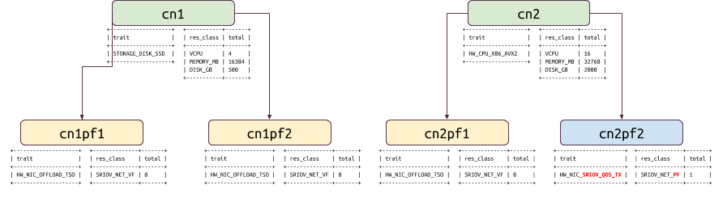

# An Update on the Placement API and Scheduler plans for Queens

This article provides an update on the progress that has been made by the
OpenStack contributor community in the area of the Nova scheduler and Placement
services. I'll also outline the blueprints we are tackling in the Queens
release cycle and provide a roadmap for the big ticket items we want to
complete in the next few releases.

1. [Recap of previous release accomplishments](#recap-of-previous-release-accomplishments)
1. [Priorities for Queens release](#priorities-for-queens)
  1. [Properly handling move operations](#properly-handling-move-operations)
  1. [Alternate host lists and in-cell retries](#alternate-host-lists-and-in-cell-retries)
  1. [Nested resource providers](#nested-resource-providers)

## Recap of previous release accomplishments

Recall that the Placement API was exposed as a separate API endpoint in the
Newton release of OpenStack.

Since then, the team has been steadily improving the API and integrating it
further into Nova. In the Newton release focused mainly on getting the
`nova-compute` workers to **properly inventory** local (to the compute node)
resources and send those inventory records to the Placement API.

In Ocata, we began the integration of the `nova-scheduler` service with the
Placement API. We modified the scheduler to make use of the Placement API in
**filtering compute nodes** that met some basic resource requests.

In the Pike release we focused on moving the location of where we **claim
resources** from the `nova-compute` worker to the `nova-scheduler` service. The
reason for this focus was two-fold: performance/scale and alignment with the
Cells V2 architecture. I'll cover the details of this in the section below
called "Alternate host lists and in-cell retries".

## Priorities for Queens

At the Denver Project Team Gathering, the Nova contributor team resolved to
work on three primary areas in the scheduler and resource placement functional
areas. It should be noted that we understand that there are many, many
additional feature requests in this area -- some having been on our radar for
years. We recognize that it can be frustrating for operators and potential
users to see some longstanding issues and items not receieve priority for
Queens. However, there is only so much review bandwidth that the core team
realistically has, and choices do need to be made. We welcome discussion of
those choices both at the PTG and on the mailing list.

It should also be noted that while there are only three priority workstreams
for the scheduler and resource placement area in Queens, that does **NOT** mean
that no other proposed items will be reviewed or make progress. It simply means
that the core teams' review focus will be on patch sets that further the effort
in these areas.

### Properly handling move operations

The first priority effort we're tackling in Queens is cleaning up and fully
covering the functional test coverage of move operations -- migrate, rebuild,
resize, evacuate, unshelve, etc -- in relation to the placement API.

In the waning days of the Pike release, Balasz Gibizer, Dan Smith and Matt
Riedemann identified a number of issues regarding how resources were being
tracked (or not) in the Placement API during the various move operations
supported by Nova. Note that in the Pike release, we began claiming resources
in the `nova-scheduler` service. We clearly needed to do this claim process for
move operations as well. The initial solution we came up with creating a sort
of "doubled-up allocation" for the instance during a move operation, with
resources from both the source and destination host being consumed by the
instance in a single set of allocation records. This worked but there were
obvious warts in the solution especially around things like same-host resize
operations.

There was a steady stream of incoming bugs about how various move operations
resulted in missing or incorrect allocation records, and we needed to put some
fairly nasty code into the resource tracker and compute manager code in order
to deal with rolling upgrade scenarios where newer conductor and scheduler
services needed to properly handle and not "correct" inaccurate data that older
compute nodes might be writing.

[Dan Smith identified](http://specs.openstack.org/openstack/nova-specs/specs/queens/approved/migration-allocations.html)
a pretty ingenious way of solving the problem with
allocation tracking during move operations in the Pike release but due to time
constraints we weren't able to implement his solution in Pike.

Now that we're in Queens, we're prioritizing Dan's solution, which is to change
the ownership of allocation records on the source (before move) host from the
compute node UUID to the UUID of the migration object itself. This allows the
allocation of resources on the destination host to be allocated to the instance
UUID and, upon successful move, we merely delete the allocations consumed by
the migration UUID. No more messing around with doubled-up allocations.

### Alternate host lists and in-cell retries

The second priority effort has to do with enabling retries of launch requests
within a Cells V2 deployment.

Above, I noted that the reasons for changing the location of resource claim
operations from the `nova-compute` host to the `nova-scheduler` service was
two-fold. Let me elaborate.

First, there exists a problem in current versions of Nova where two scheduler
processes pick the same host for two different instances, and whichever launch
process ends up getting to that host first ends up consuming the last bit of
resources on the host. The unlucky second launch process must then do what is
called a "scheduler retry". This process is quite heavyweight; the scheduler
must be called again over RPC to get a new destination host for the instance
and various pieces of state about the retry need to be passed in the request
spec. Plus, there's no guarantee that when the retry hits a new destination
host that the exact same fate might befall it and cause yet another retry.

Claiming resources within the `nova-scheduler` instead of on the destination
compute host means that we can dramatically reduce the length of time and
complexity of the primary cause of retry operations. We now attempt to claim
resources against the chosen destination host from the `nova-scheduler`
service. If the Placement API returns a `200 OK`, we know that the instance has
already consumed resources on the destination host and the only thing that can
trigger a retry would be some sort of weird host failure -- something that is
not a commonly-occurring event. If the Placement API returns a `409 Conflict`,
we can tell from the information returned in the error response whether the
failure was due to a concurrent update or whether the destination host no
longer has any capacity to house the instance.

If another process ended up claiming resources on the destination host in the
time interval between initial selection and the attempt to claim resources for
our instance, we simply retry (in a tight loop within the scheduler code) our
attempt to claim resources against that destination host. If the destination
host was exhausted of resources, then the scheduler moves on to trying another
destination host.  We do all this without ever sending the launch request down
to a target compute host.

The second reason we wanted to move the claiming of resources into the
`nova-scheduler` was because of the Cells V2 design. Recall that the Cells V2
architecture is designed to remove the peculiarities and segregated API layers
of the old Cells V1 codebase. Having a single API control plane in Cells V2
means simpler code and thus easier to maintain code.

However, one of the design tenets of the Cells V2 architecture is that once a
launch (or move) instance request gets to the target cell, there is no "upcall"
ability for the target cell to communicate to the API layer. This is
problematic for our existing retry mechanism. The current retry mechanism
relies on the compute host which failed the initial resource claim being able
to call "back up" to the scheduler to identify another host to attempt the
launch on.

[Ed Smith is leading the effort](https://blueprints.launchpad.net/nova/+spec/return-alternate-hosts)
in Queens to have the scheduler pass a set of alternate host and allocation
information from the API/scheduler layer down into a target cell. This
alternate host and allocation information will be used by the cell conductor to
retry the launch against an alternative destination, claiming the instance's
resources on that alternative host without the cell conductor needing to
contact the higher API/scheduler layer.

### Nested resource providers

The third priority effort is around something called "nested resource
providers".

Sometimes there is a natural parent-child relationship between two providers of
resources. Examples of this relationship include NUMA cells and their
containing host, SR-IOV physical functions and their containing host, and
physical GPU groups and their containing host.

Let's say we have two compute nodes. Both compute nodes have 2 physical
functions each. The first compute node has been set up so each physical
function has an inventory of 8 virtual functions. The second compute node has
been set up so that one of the physical functions is marked as passthrough --
meaning the guest will have full control over it. The other physical function
is configured to have an inventory of 8 virtual functions assignable to guests,
similar to the first compute node's physical functions.

Currently, the Placement API does not understand the relationship between
parent and child providers. The nested resource providers spec and patch series
adds this awareness to the placement service and allows users to specify the
parent provider UUID of a child resource provider.

The nested resource providers work opens up a number of use cases involving PCI
devices, advanced networking, NUMA support and more. For this reason, it was
decided to put shared resource provider support on the backburner for Queens
and focus on getting at least rudimentary support for simple nested resource
providers done for SR-IOV PF to VF relationships.

### Other items to try in Queens

#### Completion of trait-flavor wiring

## Beyond Queens

### NUMA support

### Shared resource provider testing and cleanup

### Generic device manager
