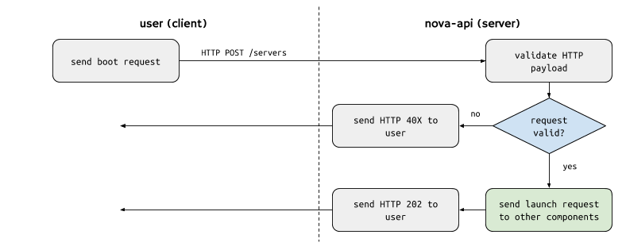
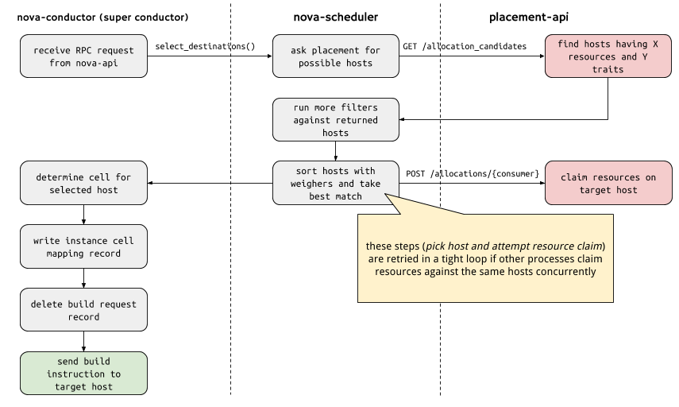

# Walkthrough of a typical Nova boot request

This article provides an in-depth walkthrough of a typical boot request that a
user might execute against the OpenStack Compute API. We describe each of the
many components involved in the launch request and the structure of the
payloads sent and received in the communication between these components.

Talking about this boot request should provide some shared terminology and
allow me to introduce some of the fundamental components that are written about
in other articles.

The boot request described here is deliberately simple. We want to start with
the basics and then iteratively add more complex concepts in later sections.

The OpenStack Pike release is used for this walkthrough. Where possible, we've
noted differences between earlier versions of OpenStack that affect the
described processes.

1. [The boot request](#the-boot-request-from-the-user)
    1. [The flavor](#the-flavor)
    1. [The image](#the-image)
1. [API server receives boot request](#openstack-compute-api-server-receives-boot-request)
    1. [Validate request](#validate-http-payload)
    1. [Construct build request](#construct-build-request)
    1. [Send build request to conductor](#send-build-request-to-conductor)
1. [Super conductor starts coordinating](#super-conductor-coordinates-placement-and-target-cell-calls)

## The boot request from the user

Our user, let's call her Alice, wants to launch a virtual machine that will
host her simple single-server web application.

She may end up using the [openstack CLI tool's `server create`
command](https://docs.openstack.org/python-openstackclient/latest/cli/command-objects/server.html#server-create).
Or she may use the [Horizon web UI](https://docs.openstack.org/horizon/latest/)
for her OpenStack deployment.

Regardless of which tool Alice uses to launch her instance, that tool
will inevitably end up making an HTTP request to the [`POST
/servers`](https://developer.openstack.org/api-ref/compute/#create-server)
OpenStack Compute HTTP API.

This HTTP request to the `POST /servers` API takes a payload of data that
specifies a number of launch configuration parameters. Let's take a look at a
couple of the important ones.

### The flavor

The `flavorRef` element of the payload identifies the "flavor" of machine that
you wish to launch.

The flavor is a collection of attributes that describe the sizing of the
machine and certain properties about the target host that the machine expects
to find. The `flavorRef` points at a flavor object that can be retrieved using
[`GET /flavors/{flavorRef}`](https://developer.openstack.org/api-ref/compute/#show-flavor-details).

Properties of the flavor that refer to machine sizing include:

* `vcpus`: The number of virtual CPUs your machine should be allocated
* `ram`: The amount, in MB, of memory your machine should be allocated
* `disk`: The amount, in GB, of physical disk space your machine should be
  allocated

Properties of the flavor that refer to certain required attributes of the
target host are kept in something called the [flavor's "extra\_specs"](https://developer.openstack.org/api-ref/compute/#show-flavor-details).

These required target host attributes are visible to the end user, however the
flavor itself is intended to hide these implementation details from the user.

### The image

The `imageRef` element of the payload identifies the bootable virtual machine
image that the user wishes to launch.

Similar to the flavor, the image has a collection of key/value pairs that
indicate the required attributes of the target host for machines launched using
this image as its root/boot disk. Confusingly, while this set of key/value
pairs is identical in concept and function to the flavor "extra\_specs", for
images, this data is called "metadata" instead.

## OpenStack Compute API server receives boot request

The HTTP `POST /servers` request that describes Alice's request to boot her
server is sent to the OpenStack Compute API server by the client that Alice
uses. This server is called `nova-api` and handles all incoming user requests.

For most "action requests" like `POST /servers`, the `nova-api` server
predominantly is responsible for doing some basic HTTP request payload
validation, asynchronously sending off one or more requests to other Nova
services, and finally returning an `HTTP 202` response to the user.

**Note**: The `HTTP 202` response indicates to the calling user that the
request to perform some action has been successfully received and that the
request will be processed. It does **not** mean that the operation being
requested to perform (in this case, to launch a server instance) has completed
successfully.

### Validate HTTP payload

Each HTTP resource endpoint is handled by a method on a controller class. These
controller classes are all in the `nova/api/openstack/compute` source code
directory. For example, the `POST /servers` HTTP call is handled by the
[`nova.api.openstack.compute.servers.ServersController.create()`](https://github.com/openstack/nova/blob/stable/pike/nova/api/openstack/compute/servers.py#L453) method.

### Construct "build request"

Once the basic HTTP payload has been validated, `nova-api`'s next step is to
[create the "build request"](https://github.com/openstack/nova/blob/stable/pike/nova/compute/api.py#L880).
The build request contains information from the user's boot request along with
lots of other important information:

* a request UUID to identify the specific request from the user
* a pre-generated UUID to identify the to-be-created instance(s)
* block devices to be created for the instance
* networks, ports and IP addresses for the instance
* server "groups" that the instance belongs to
* user-defined tags to associate with the instance

### Send build request to conductor

Once the build requests (one per requested instance) have been created,
`nova-api` [sends these build request objects](https://github.com/openstack/nova/blob/stable/pike/nova/compute/api.py#L1170) to the **top-level** `nova-conductor` service
via an async/cast RPC message. This top-level `nova-conductor` service is known
as the "super conductor". There are other `nova-conductor` services that
function at a cell level. These `nova-conductor` services are called either
"cell conductors" or "cell-local conductors".

## Super conductor coordinates placement and targeted cell calls

Once the top-level `nova-conductor` (the super conductor) [receives the request](https://github.com/openstack/nova/blob/stable/pike/nova/conductor/manager.py#L1018)
from the `nova-api` service, the super conductor begins a process of
determining which compute host can house the new instance and sending an
asynchronous message to that selected target compute host to spawn the instance
on its hypervisor.

### Call scheduler `select_destinations()`

The first step in the `nova-conductor`'s coordination process is to ask the
`nova-scheduler` service to determine which compute host has the capacity to
handle the new instance. The super conductor calls the `nova-scheduler`'s
[`select_destinations()`](https://github.com/openstack/nova/blob/stable/pike/nova/conductor/manager.py#L625) RPC method to do this.

#### Scheduler asks Placement for possible resource providers

### Send build instruction to selected host in cell
