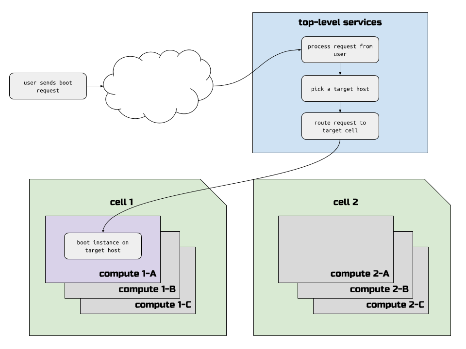
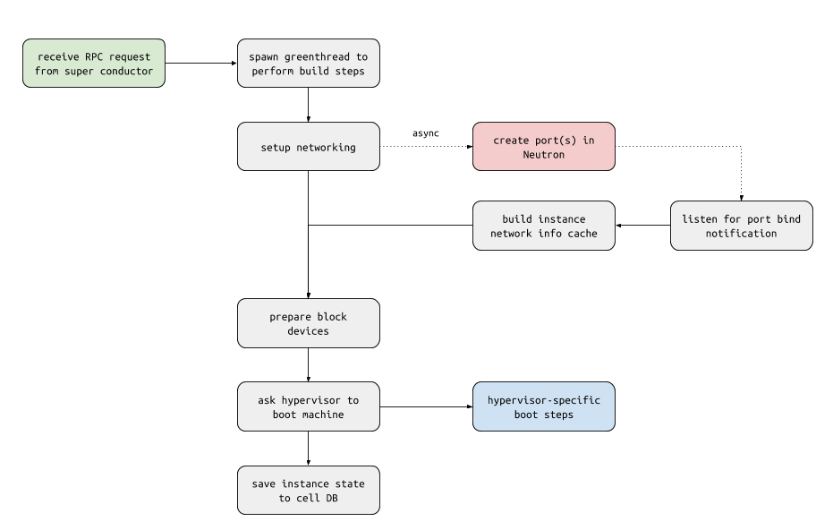

# Walkthrough of a typical Nova boot request

This article provides an in-depth walkthrough of a typical boot request that a
user might execute against the OpenStack Compute API. We describe each of the
many components involved in the launch request and the structure of the
payloads sent and received in the communication between these components.

Talking about this boot request should provide some shared terminology and
allow us to introduce some of the fundamental components that are written about
in other articles.

The boot request described here is deliberately simple. We want to start with
the basics and then iteratively add more complex concepts in later articles.

**NOTE**: The OpenStack Pike release is used for this walkthrough. Where
possible, we've noted differences between earlier versions of OpenStack that
affect the described processes.

**NOTE**: We've used a default Nova configuration for this walkthrough. In
particular, that means we're using the filter scheduler (not the caching
scheduler), the libvirt/KVM hypervisor driver, and no custom out of tree
scheduler filters.

At a super-high level, a successful boot request to Nova looks like this:



The user sends the boot request to the OpenStack Compute API, which lives at a
logical "top-level services" layer. A set of top-level services process the
request, determine which compute host will house the new instance, and routes
the request to the appropriate cell. Cells are internal (to Nova) groups of
compute hosts. Once the target compute host receives the build request, it
spawns the instance on its hypervisor.

Of course, the devil is in the details, and this article is all about the
details. We'll be covering each of the following steps thoroughly in different
sections of the article, with lots of links to the actual code in Nova that
accomplishes the particular step.

1. [User sends boot request](#user-sends-boot-request-to-openstack-compute-api)
    1. [The flavor](#the-flavor)
    1. [The image](#the-image)
1. [API server receives boot request](#openstack-compute-api-server-receives-boot-request)
    1. [Validate request](#validate-http-payload)
    1. [Construct build request](#construct-build-request)
    1. [Send build request to conductor](#send-build-request-to-conductor)
1. [Super conductor starts coordinating](#super-conductor-coordinates-placement-and-target-cell-calls)
    1. [Find a destination host (schedule the instance)](#call-scheduler-select-destinations)
        1. [Ask Placement for possible hosts](#scheduler-asks-placement-for-possible-destination-hosts)
        1. [Choose a destination host](#scheduler-chooses-destination-host)
        1. [Claim resources on destination host](#scheduler-claims-resources-on-destination-host)
    1. [Send build instructions to destination host](#send-build-instructions-to-selected-host-in-target-cell)
1. [Destination compute builds instance](#destination-compute-builds-instance)
    1. [Create network plug points](#create-network-plug-points)
    1. [Prepare block devices](#prepare-block-devices)
    1. [Hypervisor spawns instance](#hypervisor-spawns-instance)
    1. [Save instance state to cell DB](#save-instance-state-to-cell-db)

## User sends boot request to OpenStack Compute API

Our user, let's call her Alice, wants to launch a virtual machine that will
host her simple single-server web application.

She may end up using the [openstack CLI tool's `server create`
command](https://docs.openstack.org/python-openstackclient/latest/cli/command-objects/server.html#server-create).
Or she may use the [Horizon web UI](https://docs.openstack.org/horizon/latest/)
for her OpenStack deployment.

Regardless of which tool Alice uses to launch her instance, that tool
will inevitably end up making an HTTP request to the [`POST
/servers`](https://developer.openstack.org/api-ref/compute/#create-server)
OpenStack Compute HTTP API.

For completeness, it's worth mentioning that before the client actually
communicated with the OpenStack Compute API, the client first must communicate
with the OpenStack Identity API (Keystone) in order to get an access token.
This access token is then supplied in the HTTP headers by the client in its
request to the OpenStack Compute API.

This HTTP request to the [`POST /servers`](https://developer.openstack.org/api-ref/compute/#create-server) API takes a payload of data that
specifies a number of launch configuration parameters. Let's take a look at a
couple of the important ones.

### The flavor

The `flavorRef` element of the payload identifies the "flavor" of machine that
you wish to launch.

The flavor is a collection of attributes that describe the sizing of the
machine and certain properties about the target host that the machine expects
to find. The `flavorRef` points at a flavor object that can be retrieved using
[`GET /flavors/{flavorRef}`](https://developer.openstack.org/api-ref/compute/#show-flavor-details).

Properties of the flavor that refer to machine sizing include:

* `vcpus`: The number of virtual CPUs your machine should be allocated
* `ram`: The amount, in MB, of memory your machine should be allocated
* `disk`: The amount, in GB, of physical disk space your machine should be
  allocated

Properties of the flavor that refer to certain required attributes of the
target host are kept in something called the [flavor's "extra\_specs"](https://developer.openstack.org/api-ref/compute/#show-flavor-details).

These required target host attributes are visible to the end user, however the
flavor itself is intended to hide these implementation details from the user.

### The image

The `imageRef` element of the payload identifies the bootable virtual machine
image that the user wishes to launch.

Similar to the flavor, the image has a collection of key/value pairs that
indicate the required attributes of the target host for machines launched using
this image as its root/boot disk. Confusingly, while this set of key/value
pairs is identical in concept and function to the flavor "extra\_specs", for
images, this data is called "metadata" instead.

Wondering what image metadata keys and expected values are possible? The most
reliable list of these things unfortunately is the source code itself, which
you can find
[here](https://github.com/openstack/nova/blob/stable/pike/nova/objects/image_meta.py#L225-L460).

## OpenStack Compute API server receives boot request

The HTTP `POST /servers` request that describes Alice's request to boot her
server is sent to the OpenStack Compute API server by the client that Alice
uses. This server is called `nova-api` and it handles all incoming user
requests.

For many "action requests" like `POST /servers`, the `nova-api` server
predominantly is responsible for doing some basic HTTP request payload
validation, asynchronously sending off one or more requests to other Nova
services, and finally returning an `HTTP 202` response to the user.


**Note**: The `HTTP 202` response indicates to the calling user that the
request to perform some action has been successfully received and that the
request will be processed. It does **not** mean that the operation being
requested to perform (in this case, to launch a server instance) has completed
successfully.

### Validate HTTP payload

Each HTTP resource endpoint is handled by a method on a controller class. These
controller classes are all in the `nova/api/openstack/compute` source code
directory. For example, the `POST /servers` HTTP call is handled by the
[`nova.api.openstack.compute.servers.ServersController.create()`](https://github.com/openstack/nova/blob/stable/pike/nova/api/openstack/compute/servers.py#L453) method.

### Construct "build request"

Once the basic HTTP payload has been validated, `nova-api`'s next step is to
[create the "build request"](https://github.com/openstack/nova/blob/stable/pike/nova/compute/api.py#L880).
The build request contains information from the user's boot request along with
lots of other important information:

* a request UUID to identify the specific request from the user
* a pre-generated UUID to identify the to-be-created instance(s)
* block devices to be created for the instance
* networks, ports and IP addresses for the instance
* server "groups" that the instance belongs to
* user-defined tags to associate with the instance

### Send build request to conductor

Once the build requests (one per requested instance) have been created,
`nova-api` [sends these build request objects](https://github.com/openstack/nova/blob/stable/pike/nova/compute/api.py#L1170) to the **top-level** `nova-conductor` service
via an async/cast RPC message. This top-level `nova-conductor` service is known
as the **_super conductor_**. There are other `nova-conductor` services that
function at a cell level. These `nova-conductor` services are called either
**_cell conductors_** or **_cell-local conductors_**.

## Super conductor coordinates placement and targeted cell calls

Once the top-level `nova-conductor` (the super conductor) [receives the request](https://github.com/openstack/nova/blob/stable/pike/nova/conductor/manager.py#L1018)
from the `nova-api` service, the super conductor begins a process of
determining which compute host can house the new instance and sending an
asynchronous message to that selected target compute host to spawn the instance
on its hypervisor.


### Call scheduler `select_destinations()`

The first step in the `nova-conductor`'s coordination process is to ask the
`nova-scheduler` service to determine which compute host has the capacity to
handle the new instance. The super conductor calls the `nova-scheduler`'s
[`select_destinations()`](https://github.com/openstack/nova/blob/stable/pike/nova/conductor/manager.py#L625) RPC method to do this.

The `select_destinations()` `nova-scheduler` RPC method [returns](https://github.com/openstack/nova/blob/stable/pike/nova/scheduler/driver.py#L64) a list of dicts
to the super conductor. Each dict in this list contains information about the
destination `nova-compute` service that will launch each of the instances in
the request.

**Note**: We keep saying "each of the instances in the request". This is
because the OpenStack Compute API's `POST /servers` call allows the user to
specify a `min_count` value in the request. This `min_count` value is the
number of instances (having the same flavor and image) that Nova will attempt
to spawn for the user. Behind the scenes, when Nova sees a `min_count` value
greater than 1, it creates multiple build requests, up to the value of
`min_count`.

#### Scheduler asks Placement for possible destination hosts

Once the `nova-scheduler` server receives a call to its `select_destinations()`
RPC method, one of the first things it does is [ask the `placement-api` service for a set of "allocation candidates"](https://github.com/openstack/nova/blob/stable/pike/nova/scheduler/manager.py#L124).

The [`placement-api`](https://docs.openstack.org/nova/latest/user/placement.html) service is an HTTP server that exposes information about
the things that provide resources to consumers of those resources. This HTTP
server was introduced in the Newton OpenStack release and over the last three
releases has slowly been taking a more significant role in tracking resources
in an OpenStack deployment.

A thorough discussion of how the Placement API models resource information is
out of scope for this particular article. Instead, we'll describe the concepts
involved in the specific requests made by `nova-scheduler` to the Placement
API.

As mentioned above, `nova-scheduler` asks the Placement API for something
called **_allocation candidates_**. Let's examine what this call actually looks
like.

The [`GET /allocation_candidates`](https://developer.openstack.org/api-ref/placement/#list-allocation-candidates) HTTP request is called with a set of query
string parameters detailing the amounts of different resources that the
instance requires. `nova-scheduler` [examines the flavor](https://github.com/openstack/nova/blob/stable/pike/nova/scheduler/manager.py#L121) the user asked for and
[constructs](https://github.com/openstack/nova/blob/stable/pike/nova/scheduler/client/report.py#L328-L335) a query string with a `resources=` parameter that looks something
like this:

```
GET /allocation_candidates?resources=VCPU:1,MEMORY_MB:2048,DISK_GB:100
```

The above would represent a request for a flavor that had 1 vCPU, 2 GB of RAM
and 100 GB of ephemeral disk storage.

The Placement API sends back to `nova-scheduler` an HTTP response that contains
two primary elements: a list of **_allocation requests_** and a dict of information
about the providers involved in those allocation requests called **_provider summaries_**.

```
{
  "allocation_requests": [
    <ALLOCATION_REQUEST_1>,
    ...
    <ALLOCATION_REQUEST_N>
  ],
  "provider_summaries": {
    <COMPUTE_NODE_UUID_1>: <PROVIDER_SUMMARY_1>,
    ...
    <COMPUTE_NODE_UUID_N>: <PROVIDER_SUMMARY_N>,
  }
}
```

To make the following easier to grok, let us assume that we have a deployment
of three compute nodes, each of which has 24 CPU cores, 192GB of RAM and 1TB of
disk space for use by ephemeral disk images.

Let's take a look at what a possible HTTP response from the Placement API might
look like.

##### Allocation requests

The first section of the HTTP response is for the allocation requests. These
are JSON objects that are meant to be sent to the Placement API to **_claim
resources_** for the instance against one or more compute nodes. There is one
allocation request object returned for each possible destination compute host
that can house the to-be-launched instance.

The **_resource_provider_** element of the allocation request is a JSON object
containing the UUID of the compute node that will have resources consumed from
it *if the allocation request is used to claim resources against that compute
node*. The **_resources_** element of the allocation request is a JSON object
containing each of the *requested resource amounts* that would be consumed by
the new instance. These amounts will match the flavor's set of requested
resources.

In our scenario, the allocation requests might look like this:

```
  "allocation_requests": [
    {
      "allocations": [
        {
          "resource_provider": {
            "uuid": "30742363-f65e-4012-a60a-43e0bec38f0e"
          },
          "resources": {
            "VCPU: 1,
            "MEMORY_MB": 2048,
            "DISK_GB": 100
          }
        }
      ]
    },
    {
      "allocations": [
        {
          "resource_provider": {
            "uuid": "a4eb85f2-c903-4cc7-b7ff-5d423fc3523d"
          },
          "resources": {
            "VCPU: 1,
            "MEMORY_MB": 2048,
            "DISK_GB": 100
          }
        }
      ]
    },
    {
      "allocations": [
        {
          "resource_provider": {
            "uuid": "d1cfddcc-f2f8-4da4-bf9a-1d1f2ace7a94"
          },
          "resources": {
            "VCPU: 1,
            "MEMORY_MB": 2048,
            "DISK_GB": 100
          }
        }
      ]
    }
  ],
```

In the example output above, you see three separate allocation request objects.
Each allocation request object would consume resources for the new instance
from each compute node in the example deployment. When `nova-scheduler` picks a
destination compute host for Alice's instance, it will attempt to *claim*
resources against that compute host. It will use one of the allocation requests
to perform that claim (more below).

##### Provider summaries

The other part of the HTTP response to `GET /allocation_candidates` is the
**_provider_summaries_** object. This is a map of UUID to summary information
about the compute nodes involved in any of the allocation requests. Here is
what this part of the response might look like for our scenario:

```
  "provider_summaries": {
    "30742363-f65e-4012-a60a-43e0bec38f0e": {
      "resources": {
        "DISK_GB": {
          "capacity": 1000,
          "used": 100
        },
        "MEMORY_MB": {
          "capacity": 294912,
          "used": 2560
        },
        "VCPU": {
          "capacity": 24,
          "used": 40
        }
      }
    },
    "a4eb85f2-c903-4cc7-b7ff-5d423fc3523d": {
      "resources": {
        "DISK_GB": {
          "capacity": 1000,
          "used": 0
        },
        "MEMORY_MB": {
          "capacity": 294912,
          "used": 65536
        },
        "VCPU": {
          "capacity": 384,
          "used": 16
        }
      }
    },
    "d1cfddcc-f2f8-4da4-bf9a-1d1f2ace7a94": {
      "resources": {
        "DISK_GB": {
          "capacity": 1000,
          "used": 0
        },
        "MEMORY_MB": {
          "capacity": 294912,
          "used": 2560
        },
        "VCPU": {
          "capacity": 384,
          "used": 0
        }
      }
    }
  }
```

These two components of the HTTP response are used by the scheduler to do two
things:

1. To reduce the number of compute nodes that the scheduler processes to
   determine a destination for the instance (the "provider_summaries" component
   of the response is used for this)
1. To claim resources against the selected destination host (the
   "allocation_requests" component of the response is used for this)

Let's look in detail of how the scheduler uses the above information in these
next steps.

#### Scheduler chooses a destination host

As noted above, `nova-scheduler` uses the "provider_summaries" part of the HTTP
response from `GET /allocation_candidates` to reduce the number of compute
nodes that the scheduler processes to determine a destination for each instance
in the request.

It currently (as of the Pike release) does this by simply [grabbing the keys
from the `provider_summaries` dict](https://github.com/openstack/nova/blob/stable/pike/nova/scheduler/filter_scheduler.py#L334-L338) in the HTTP response and passing those UUIDs
in its own call to [get records from the `compute_nodes` tables](https://github.com/openstack/nova/blob/stable/pike/nova/scheduler/host_manager.py#L647-L649) that exist in
each cell database.

After these calls to the cell databases, the scheduler will have a set of
[`nova.objects.ComputeNode`](https://github.com/openstack/nova/blob/stable/pike/nova/objects/compute_node.py#L33) objects that represent the compute hosts which have
the capacity to satisfy the request for the resources described by the flavor
being requested. `nova-scheduler` then translates these `ComputeNode` objects
into something called a [`HostState`](https://github.com/openstack/nova/blob/stable/pike/nova/scheduler/host_manager.py#L103) object that is an internal (to the
scheduler) structure that is used to represent, well, the compute host's
resource state.

At this point, `nova-scheduler` [passes](https://github.com/openstack/nova/blob/stable/pike/nova/scheduler/filter_scheduler.py#L300-L301) these `HostState` objects to its
collection of filters and weighers. The filters further winnow the number of
possible destination hosts, looking at complex predicates involving server
groups, NUMA topology requests, PCI passthrough requests, and CPU capabilities
requests. The weighers are responsible for [sorting the filtered list](https://github.com/openstack/nova/blob/stable/pike/nova/scheduler/filter_scheduler.py#L308-L309) of
destination hosts.

Once the weighers have sorted the list of destination hosts, `nova-scheduler`
simply picks the first destination host in that sorted list as the selected
host for the instance. The next step is to claim the requested resources
against this selected destination host.

#### Scheduler claims resources on destination host

Now that the scheduler has a list of sorted compute hosts that have all the
requested resources and meet all the required constraints, the scheduler must
attempt to **_claim those resources_** on the selected destination host.

"Claiming resources" means the process of allocating some amount of resources
being provided by a compute node to the consumer of those resources: the
newly-launched instance. From a technical perspective, the process of claiming
resources for an instance involves the [writing of one or more allocation
records](https://github.com/openstack/nova/blob/stable/pike/nova/objects/resource_provider.py#L1796-L1857)
in the Placement service's database in a transactional manner.

The Pike release of OpenStack brought a major change to the boot process.
Before Ocata, we claim resources right before the instance is spawned on a
compute host, and we perform the claim operation **_on the compute host
itself_**. This approach was problematic in a number of ways, but one of the
biggest problems was that due to the long period of time in between selection
of a destination host (by the scheduler) and the actual resource claim on the
destination host, there was a greater chance of two scheduler processes both
picking the same destination host and one of them consuming the last bit of
resources on a compute host. This would trigger something called a "retry", and
these retries are costly operations that go all the way back to the scheduler
to find a new destination host and back down into a cell to the new destination
host where another retry could be triggered.

In Pike, we modified the boot process to eliminate the major cause for retry
operations: resource contention and the stampeding herd effects of a delayed
simulataneous resource claim. We now [claim resources against the target
compute host](https://github.com/openstack/nova/blob/stable/pike/nova/scheduler/filter_scheduler.py#L215-L216) **in `nova-scheduler`**.

If multiple scheduler processes end up trying to claim resources on the same
compute host -- and one of them ends up exhausting the compute host's resources
-- `nova-scheduler` now immediately picks a new destination host from its
[sorted list of matching compute hosts](https://github.com/openstack/nova/blob/stable/pike/nova/scheduler/filter_scheduler.py#L207) and attempts to claim resources against
that next alternate host.

All this means that by the time the super conductor gets a return from
`nova-scheduler`'s select_destinations() method, *resources have already been
allocated from the destination host to the new instance*. No more resource
contention happening on the compute hosts, which means no more reason for the
costly retry operation that must call the scheduler again. In fact, this means
that the compute host in the cell has no reason to "upcall" to the top-level
services tier any more.

### Send build instructions to selected host in target cell

Now that the scheduler has returned to the super conductor a destination host
for Alice's new instance, the super conductor is responsible for sending build
instructions to that destination host. Before doing this routing, however,
the super conductor [ensures](https://github.com/openstack/nova/blob/stable/pike/nova/conductor/manager.py#L597-L599) that the top-level services tier has a
record of where the instance is being sent. Having this record is important,
obviously, for routing actionable requests from Alice in the future to do
things like reboot or terminate the server instance.

Once that instance to cell/host mapping is written, the super conductor [sends](https://github.com/openstack/nova/blob/stable/pike/nova/conductor/manager.py#L611-L620)
an RPC message to spawn the instance directly to the compute host that was
selected by the scheduler.

## Destination compute builds instance

The build instructions sent from the super conductor [arrive](https://github.com/openstack/nova/blob/stable/pike/nova/compute/manager.py#L1741)
over RPC at the compute host that was selected by the scheduler for Alice's new
instance. Because the steps to actually set up and boot the virtual machine can
take a long time (seconds), the first thing the compute host manager does is
[spawn a greenthread to perform the actual build steps](https://github.com/openstack/nova/blob/stable/pike/nova/compute/manager.py#L1792-L1796).
This ensures that the primary thread that handles RPC communication doesn't
block waiting for any of the steps being taken to launch the new instance; it
can remain responsive to other callers.



### Create network plug points

One of the first steps the manager on the compute host performs is ensuring
that network plug points are established for the new instance. Because this
step involves coordination with the OpenStack Networking API (Neutron), we use
an async callback strategy to allow other build steps (namely, block device
setup) to occur while network and port binding details are set up.

The [`_build_networks_for_instance()`](https://github.com/openstack/nova/blob/stable/pike/nova/compute/manager.py#L1442) method on the compute manager is
the primary entrypoint for where the networking information is set up. However,
the asynchronous part of this method is actually the [`_allocate_network_async()`](https://github.com/openstack/nova/blob/stable/pike/nova/compute/manager.py#L1388-L1439)
method, which must run after the hypervisor has been asked to [calculate MAC addresses](https://github.com/openstack/nova/blob/stable/pike/nova/compute/manager.py#L1459)
and [DHCP information](https://github.com/openstack/nova/blob/stable/pike/nova/compute/manager.py#L1460) for the new instance's virtual network interfaces.

### Prepare block devices

TODO

### Hypervisor spawns instance

TODO

### Save instance state to cell DB

TODO
